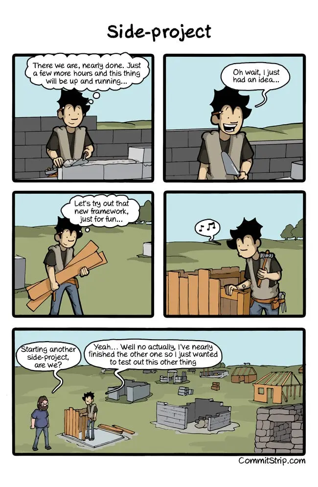

Do you like to get stuff done? Have you started pet projects several times and then never finished them? Have you been working on the same personal project for a couple of years?

Do you plan to start a side project in your free time?

I have a whole cemetery of unfinished projects. Although, it's all OK at my day job; I get stuff done on time there.

This situation is not surprising. A pet project means to be all fun while finishing requires monotonous, dull polishing. However, at some point, I figured out that I want:

- to see how stuff from my head actually works, and maybe even helps others;
- to really learn something — by starting over and over I barely scratch the surface;

So, I finally decided to finish at least one of them. However, I had to figure out what kept me from making progress in the first place.

## What holds us back

We repeatedly lie to ourselves; it's the way our brains work. Instead of: "I've failed on this," I say to myself: "I am no longer interested in this." So even a little obstacle stops us.

There is no deadline.

It is hard to start work on something that is "unknown."

Moreover, even the most exciting work gets tedious over time.

There are thousands more reasons, excuses, and traps. So I threw away the idea of obscure and unclear "pet project," and focused on something certainly achievable.

## Project. Ordinary project

Everybody knows how to work on a project, and how to stay focused (I hope) — we are supposed to do this almost every day, eight hours a day.

You may think about all those Gantt charts and excel sheets, and that it gets boring already. Although, you may think that it is fascinating as well. Isn't it already fun to learn some project management? Professional career will benefit too.

Let's be realistic: finishing something is not going to be that easy, but neither it means to be frustrating. Notably, the experience and sense of accomplishment are priceless.

I often say myself:

> It is not a sprint it is a marathon

## The Goal

You should honestly answer the following question:

> _What is my ultimate goal? (Why am I doing this?)_

There are many shiny things on the way to the finish line, distracting you from getting stuff done. The answer to this question will keep your focus on top-priority tasks. The goal must be clear, to guide you like a compass. For example, saying: "I want to learn technology X," is not a clear goal. Rather, you should say: "I want to learn technology X to achieve goal Y."

The answer to the above questions must be honest. If you want to make money on your project, then why lie to yourself: "I'll make an excellent product, and money will come." It is not going to happen. You should focus on making a profit, rather than creating something that nobody will use.

## Resources

### Time

Time management is one of the hardest parts. There is no silver bullet, although there are a few tips that can help.

Start by planning. Nothing works better than the good-old Gantt charts. Estimate and write down every planned detail. Ensure that it will take more than one lifetime to complete them all. Move some features to the backlog. Repeat. Again, a clear understanding of your goal will help you to prioritize.

Keep in mind that the days in your plan are not the same as an eight-hour workday.

Track the time that you spend on a task. It will make your estimations way more accurate. Also, time tracking will tell you whether you are moving in the right direction or wasting your time on unnecessary details. Most importantly, day to day progress goes unnoticed. Seeing what has already been accomplished keeps you motivated. I love to cross-out a task on a hardware paper. Software task trackers don't have _it_.

Establish milestones and deadlines.

Deadlines don't mean to be frustrating — they are quite the opposite. You don't even have to think about it. You already have a plan — just execute it, step by step. Deadline is a wakeup call: "Am I there yet?" If not — why?

Achieving a milestone (especially in time) is a well-deserved award and a source of sweet endorphins.

The retrospective is important. What I did right? Wrong? Correct your estimations. Keep the plan up to date.

### Money

"What money in a pet-project?" — you may ask.

At first, it may seem there is no budget at all. Nevertheless, think of your own cost. You can calculate your salary per hour. Now think, what would be more efficient? To repair your sink in the kitchen by yourself or to pay someone else?

If you are supposed to make money on your project, why not start budgeting right away? You can hire someone to build you a website or do some research for you.

### Motivation

This is the most valuable resource. A pet-project lives only because you want it to. Do not wait for the inspiration to come. Manage your motivation as any other resource.

Here are some tips that work for me:

- Concentrate on a process rather than on a result. Do not think how much needs to be done. Instead think that you are going to spend next N minutes doing something you like.
- Have a list of tasks ready. There are always things to do. If you do not feel up for one task, pick another. Again, ensure that you do not waste time on unnecessary things.
- Leave unfinished work for tomorrow; write it down and forget it. I only have 2–3 hours in the evening, and it is so much easier to continue yesterday's task than starting something new. Also, it eliminates the need for warm-up (with only 2–3 hours, there is no time for cat videos).
- Have an "anchor" that turns you on, like music. Listen to one music while working, other while relaxing. I used to live and work in the 1-room apartment, so I turned on the bright light when I was working and soft low light any other time.
- Do not procrastinate. Start to do something immediately. Sharpen your pencils. Go through the yesterday's notes and the plan.
- If you want to be lazy — so be it. Just relax, treat yourself without any guilt or remorse.

Now that you have read about project management, you may still think:

> **"Where is the fun part?"**

I bet your side-project is all about something new. Why would you have begun it otherwise?

Managing an innovative product under uncertain conditions... Wait, isn't it a...

## Startup

Startups are fun — everyone knows that. There is a bunch of blogs, books, and other information on startups. Many techniques from the startup world can be used in your project right now.

### Minimum Viable Product (MVP)

Startups use MVP to prove or disprove assumptions about their audience. Such as: "people are willing to pay for this."

When it comes to personal projects, the role of MVP is a bit different. Having a viable something keeps you motivated. It is hard to work on something you cannot instantly play with. If I have to lay out a bunch of code before I will be able to run it, I write a small test. This helps me to move on (not to mention benefits of early testing).

Keep the product running not only motivates you but also disciplines you to plan changes accordingly. It allows you to concentrate on a single change at a time so that you won't be lost among too many.

### Audience

Startups seek their audience all the time, and you should. Of course, you are not alone. Many people that will love your idea as much as you do. Tell them about your project! Show your progress. They may give you useful feedback and tons of inspiration.

## Productivity is ruthless

The biggest problem is a constant lack of time. It is not just about side projects — it is common. You cannot extend your working day, although you can be more productive in the time you have.

### Follow a regime, get enough sleep

Here comes the bad news: Human beings are more productive when they are living on a schedule. If I stayed up until 4 am, the next day I would not finish my work on time. This leads to overtime, which means no time for my pet project, and so forth.

### Sport activities and diet

Exercises and healthy nutrition are essential for efficiency. It can be challenging to start, but the rewards are invaluable. It is hard to describe the feeling of a healthy body when you want to run just because you can. Because you full of energy, and your muscles beg for it.

### Stay balanced

This one is tough. Side projects can drain all your energy and lead to burnout. Spend time away from work. Let your thoughts float freely from time to time.

That is it. I hope this article will help you finish your magnificent project, and the world will become a better place, thanks to you.

---

Photo by [farhan](https://unsplash.com/@uncyno) on [Unsplash](https://unsplash.com/photos/a-building-lit-up-at-night-with-a-car-parked-in-front-of-it-ZPDIbhzID1U)

Comic [West Side-project story](https://www.commitstrip.com/en/2014/11/25/west-side-project-story/) by [CommitStrip](https://www.commitstrip.com/)

_Originally published at [www.cachelot.io](https://cachelot.io) on April 29, 2015._
