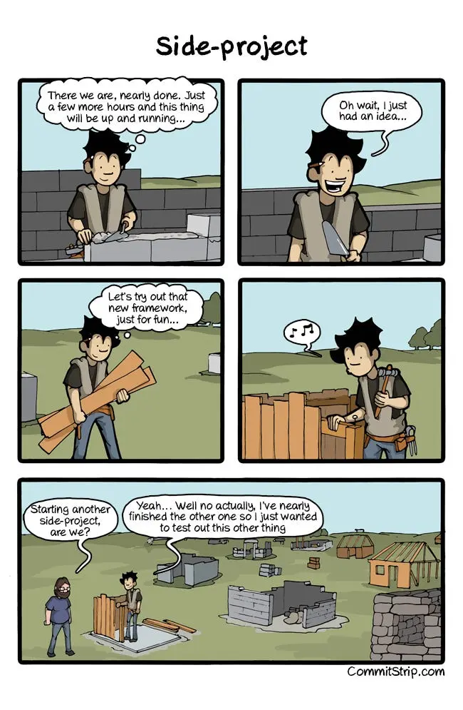
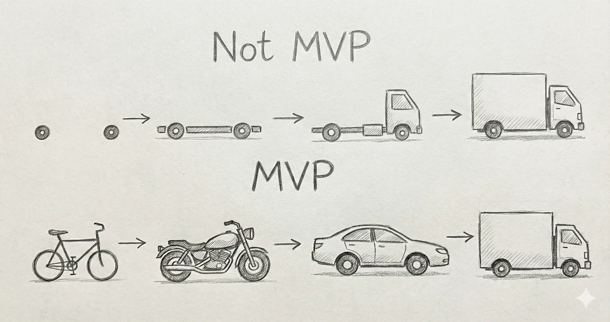

Починали свої проекти, але так і не релізили? Роками "пиляєте" одне й те саме?

Плануєте новий "сайд-проект" у вільний час?

У мене є ціле кладовище незавершених проектів. При цьому на основній роботі все ок: тікети закриваються, спринти мотаються.

Це не дивно. **Pet-проект — це про "фан"**. А завершення вимагає нудного полірування, фіксів багів і написання документації. Але в якийсь момент я зрозумів, що хочу більшого:

- Побачити свої ідеї в продакшені (і щоб ними користувався хтось, крім мами).
- Копнути технології глибше. Починаючи проекти з нуля, я постійно ковзаю по поверхні.

Тож я вирішив довести до релізу хоча б один. Але спершу треба було зрозуміти, що йде не так.

## Що нас стримує

Мозок — то хитра сволота, він нас береже. Замість чесного «У мене не виходить», ми кажемо собі: «Мені це більше не цікаво». Тому зупинити може навіть дрібна перешкода.

- Відсутність дедлайнів знищує фокус.
- Розмиті цілі приводять до 'scope creep' (ще одна фіча, і тут іще одна, останненька).
- Страх невідомого переводить у режим безкінечного "планування".

Та й навіть улюблена справа з часом приїдається.

Для себе, я взагалі відкинув ідею pet-project.

## Проект. Просто проект

Це потребує того самого часу що і робота і все іншне життя.

> 97.65% незапланованного часу буде продовбано.   <small>~ витяг з спр. ОШТР бюро статистики "чувак в інтернеті" 1987 році</small>

Ми всі знаємо, як працювати над проектами. Ми робимо це щодня по вісім годин за гроші.

Згадайте діаграми Ганта, Jira, естімейти. Нудота? Можливо. Але це працює. Хіба не круто прокачати скіли в проджект-менеджменті на *своєму* продукті?

Давайте чесно: випустити щось — це складно. Але це не має бути стражданням. Досвід і відчуття «це я зробив» — безцінні.

Моя мантра:
> Це не спринт, це марафон.

## Мета

Треба відповісти на одне питання:
> **Нахіба я це роблю?**

На шляху до релізу буде купа спокус (о, вийшов новий фреймворк, треба переписати!). Відповідь на "Нахіба?" — це ваш компас.
"Хочу вивчити технологію X" — це погана мета, бо процес навчання нескінченний.
Краще: "Хочу вивчити X, щоб зробити Y".

Будьте чесними. Хочете заробити? Не брешіть собі про "змінити світ". Фокусуйтеся на монетизації, а не на ідеальному коді.
Робите це заради кайфу? Чудово! Тоді оптимізуйте процес під отримання задоволення (для мене кайф — це показати щось і отримати фідбек від живих людей).

## Ресурси

### Час

Тайм-менеджмент — це біль. Срібної кулі немає, але є база:

1.  **Планування.** Оцініть кожну фічу. Помножте час на пі (3.14). Зрозумійте, що життя не вистачить. Викиньте половину в беклог. Повторіть.
2.  **Трекінг.** Дні в плані — це не 8-годинний робочий день. Це ваші 1-2 години ввечері, коли ви вже втомлені. Трекайте час, щоб бачити реальний прогрес.
3.  **Візуалізація.** Я люблю викреслювати таски на папері. В Jira немає *цього* тактильного відчуття маленької перемоги.
4.  **Дедлайни.** Дедлайн — це не кат з сокирою. Це контрольний дзвіночок, який вириває з бігу по колу: «Я встигаю? Якщо ні — що викидаємо або як плануємо?».
4.  **Святкування.** Це важ проект, тож хлопати вас по плечу теж доводиться переважно вам. Не забувайте про цей важливий крок.

### Гроші

«Які гроші в пет-проекті?» — спитаєте ви.

Здається, бюджету немає. Але ваш час коштує грошей.
Якщо плануєте монетизацію, почніть бюджетування. Може найняти фрілансера?
Може якийсь софт зекономить масу часу? Може викликати когось відремонтувати кран в квартирі?

### Мотивація

Це паливо. Пет-проект живе, поки є мотивація. Не чекайте натхнення — керуйте ним.

Шо спрацьовує для мене:

- Замість "мені 'треба' зробити се", "я проведу наступні 40хв за улюбленою справою" (думки → слова → дії → думки ... і так по колу, тому думки суттєво впливають на результат).
- У мене зошит. Остання TODO нотатка зі вчора — те ще, що я продовжую, як тільки сів. Ідея — це нотатка і забув, а не відволікання.
- Я закидую роботу на найцікавішому місці, як бразильський серіал.
- **Ритуали.** Музика, світло, приміщення. Мозок має знати: "О, ввімкнувся _той самий_ плейліст, ми працюємо".
- Прокрастинація забирає більше енергії ніж праця, я намагаюся не прокрастинувати, а робити щось маленьке (почитати беклог).
- Не йде? — То й добре. Відпочиваю без докорів сумління.

## Стартап

Прочитали про менеджмент і думаєте: **«А де ж фан?»**

Б'юся об заклад, ваш проект — це щось нове. Інакше нащо це все?
Менеджмент інноваційного продукту в умовах невизначеності... Це ж визначення стартапу!

### MVP (Minimal Viable Product)

У стартапах MVP потрібен для валідації гіпотез ("чи потрібно саме це?").

Морально важко працювати над тим, що не можна помацати тут і зараз.
Якщо до першого запуску треба писати код місяць — напишіть тест. Зелена галочка ✅ — це теж результат, на який можна вказати пальцем — "це зробив я".

Інкрементальні зміни постійно робочого продукту врятують від бажання "переписати все з нуля" і потенційно поховати ще один проект.

### Аудиторія

Ви не самі. Розкажіть про проект! Покажіть прогрес у Twitter чи LinkedIn. Отримайте фідбек. Один коментарій від сторонньої людини може відкрити кран нових ідей, тобто натхнення, тобто мотивації.

### Рівновага

Всі чули про вигорання. Скажу лише одне: на відміну від більшості хвороб, вигорання приходить непомітно, дбати про себе треба вже сьогодні.

Дякую, що прочитали. Щасти з проєтом, отримуйте задоволення і робіть корисне!

---

Фото від [farhan](https://unsplash.com/@uncyno) на [Unsplash](https://unsplash.com/photos/a-building-lit-up-at-night-with-a-car-parked-in-front-of-it-ZPDIbhzID1U)

Комікс [West Side-project story](https://www.commitstrip.com/en/2014/11/25/west-side-project-story/) від [CommitStrip](https://www.commitstrip.com/)

_Оригінал опубліковано на [www.cachelot.io](https://cachelot.io) 29 квітня 2015 року._
