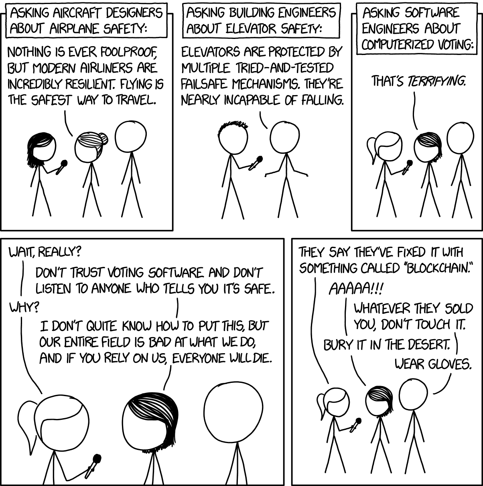

<TLDR title='Arrange code around RAM memory access. Trust the compiler.' />

## Why performance matters

We are still limited by our current hardware. There are numerous areas where it just not good enough: neural networks and virtual reality to name a few. There are plenty of devices where battery life is crucial, and we must count every single CPU tick. Even when we’re talking about clouds and microservices and lambdas, there are enormous data centers that consume vast amounts of electricity.

Even boring tests routine may quietly start to take 5 hours to run. And this is tricky. Program performance doesn‘t matter, only until it does.

A modern way to squeeze performance out of silicon is to make hardware more and more sophisticated.

> We’re going into the times where computers are tiny, cores are many, memory is a bottleneck (praying behavior to be defined).

## Meet the Modern Hardware

## CPU

- billions of transistors
- tries to predict the future
- tracks data and instructions dependencies
- execute s commands in parallel and out of order
- programmable (has its own microcode)
- aware of memory and CPU virtualization techniques
- has some high-level instructions (cryptographic hash functions)
- there is even somewhat neural network to predict branches¹
- several critical vulnerabilities were found so far

## DRAM

- billions of capacitors
- billions of capacitors, really — that’s it

> DRAM (Dynamic random-access memory) which uses memory cells consisting of one capacitor and one transistor to store each bit. This is the cheapest and highest in density, so it is used for the main memory in computers².

Memory loads and stores are often the bottleneck.

One memory reference cost at around 100 nanoseconds³. It means that 1GHz CPU can spend 100 or more ticks waiting for a value from memory. So caching values in memory instead of recalculating every time may be literally 100 times slower. Say what?!

Even though CPU is smart enough to fetch the data beforehand, in many cases, programmers are still in charge of the memory layout and access patterns.

So we have billions of lines of code in the one hand and a hardware architectural diversity in the other. Many architectures introduce opinionated methods to achieve maximal performance or minimal energy consumption.
To fill this gap is to delegate the most of work to an optimizing compiler.

> Modern compilers can do a lot of modifications to the code in order to improve performance. It is useful for the programmer to know what the compiler can do and what it can not do.
>
> ~ Agner Fog “Optimizing software in C++” ⁴

A source code we write is read by a machine and our fellow programmers. Let’s focus on the code readability while compilers turn our code into a chain of machine-optimal instructions.

Unfortunately, nothing is automagical. C and C++ optimizing compilers are far from the ideal; it is vital to understand what is under compiler’s hood. It is a tool we use on a daily basis after all.

There is this excellent video⁵: “ [Understanding Compiler Optimization — Chandler Carruth — Opening Keynote Meeting C++ 2015](https://youtu.be/FnGCDLhaxKU) ” (there is also link to a slides⁶ at the end)

I would like to make a quick recap here, alt h ough you absolutely have to watch the whole video.

I tried to repeat every example from the Chandler’s presentation myself using `clang -emit-llvm`, and most code samples here were produced directly with LLVM. Although, some listings were shamelessly copypasted from the Chandler Carruth’s slides.

> Understanding performance means understanding optimizers.
>
> ~ Chandler Carruth “Opening Keynote Meeting C++ 2015”

Even though the following listings were made with LLVM (clang), but the same principles apply to the GCC, and to some extent to an every modern optimizing compiler.

## A grasp of the LLVM IR

Compilers heavily rely on the static single assignment (SSA) form, that is: requires that each variable is *assigned exactly* ***once***, and every variable is *defined* ***before*** *it is used* ⁷.

## Hello World

```llvm
declare i32 @g(i32 %x)

define i32 @f(i32 %a, i32 %b) {
entry:
    %c = add i32 %a, %b
    %d = call i32 @g(i32 %c)
    %e = add i32 %c, %d
    ret i32 %e
}
```

The code above should be very straightforward:

- functions — `@g` and `@f`
- types — `i32`
- values (variables) — `%a`, `%b`, …
- instructions — `add`, `call`, `ret`

## Control Flow

```llvm
declare i32 @g(i32 %x)

define i32 @f(i32 %a, i32 %b, i1 %flag) {
entry:
  %c = add i32 %a, %b
  br i1 %flag, label %then, label %else

then:
  %d = call i32 @g(i32 %c) ret i32 %d

else:
  ret i32 %c
}
```

The `br` operation — branch on a flag, and go to the (corresponding) label operation. It controls the whole *control flow*.

## Data Flow

Again: each variable is *assigned exactly* ***once***, and every variable is *defined* ***before*** *it is used*.

But how can we get a value that is defined only in a conditional branch, like `%d` in the above example?

The answer is the `phi` instruction, that merges branch values into one, based on ***where you came from***.

```llvm
declare i32 @g(i32 %x)

define i32 @f(i32 %a, i32 %b, i1 %flag) {
entry:
  %c = add i32 %a, %b
  br i1 %flag, label %then, label %end

then:
  %d = call i32 @g(i32 %c) br label %end

end:
  %result = phi i32 [ %entry, %c ], [ %then, %d ]
  ret i32 %result
}
```

If we came from the `entry` then `%result = %c`, if came from the `then` then `%result = %d`.

## This is it

The LLVM IR is *that* simple. There are lots of other instructions, but nothing besides this.

Based on this representation only, you can already try to guess what’s happening behind the curtains.

## What optimizers do

## Step1: Cleanup

A compiler’s frontend produces ad-hoc IR code like there is an unlimited amount of memory; it cares only to produce patterns “familiar” to an optimizer.

Here is an example:

```c
int main(int argc, char * argv[]) {
    if (argc != 2)
        return -1;
    printf("%s", argv[1]);
    return 0;
}
```

That what we would get if we run `clang -cc1 -emit-llvm -O0 example.c -o example.ll` (no optimization). LLVM frontend places everything in a memory, so there are chains of `alloca`, `store`, and `load`:

```llvm
define i32 @main(i32 %argc, i8** %argv) #0 {
  %1 = alloca i32, align 4
  %2 = alloca i32, align 4
  %3 = alloca i8**, align 8
  store i32 0, i32* %1, align 4
  store i32 %argc, i32* %2, align 4
  store i8** %argv, i8*** %3, align 8
  %4 = load i32, i32* %2, align 4
  %5 = icmp ne i32 %4, 2
  br i1 %5, label %6, label %7

; <label>:6                                       ; preds = %0
  store i32 -1, i32* %1, align 4
  br label %12

; <label>:7                                       ; preds = %0
  %8 = load i8**, i8*** %3, align 8
  %9 = getelementptr inbounds i8*, i8** %8, i64 1
  %10 = load i8*, i8** %9, align 8
  %11 = call i32 (i8*, ...) @printf(i8* getelementptr inbounds ([3 x i8], [3 x i8]* @.str, i32 0, i32 0), i8* %10)
  store i32 0, i32* %1, align 4
  br label %12

; <label>:12                                      ; preds = %7, %6
  %13 = load i32, i32* %1, align 4
  ret i32 %13
}
```

At the cleanup stage, a compiler tries to replace memory-related instructions with SSA form values. Later, it will be decided whether to allocate memory or to use registers. Some variables (often the majority) will be eliminated at all.

This is what happens when we enable optimization (`-O1`):

```llvm
define i32 @main(i32 %argc, i8** nocapture readonly %argv) #0 {
  %1 = icmp eq i32 %argc, 2
  br i1 %1, label %2, label %6

; <label>:2                                       ; preds = %0
  %3 = getelementptr inbounds i8*, i8** %argv, i64 1
  %4 = load i8*, i8** %3, align 8, !tbaa !1
  %5 = tail call i32 (i8*, ...) @printf(i8* nonnull getelementptr inbounds ([3 x i8], [3 x i8]* @.str, i64 0, i64 0), i8* %4) #1
  br label %6

; <label>:6                                       ; preds = %0, %2
  %.0 = phi i32 [ 0, %2 ], [ -1, %0 ]
  ret i32 %.0
}
```

Of course, this code is not just cleaned, but also optimized. Now you may see how LLVM IR repeats the C code it was made from.

The `icmp` compares integers, pointers or vectors and returns boolean. The first argument is a keyword that indicates kind of comparison. Here `icmp eq` means compare for equality. Other examples would be: `ult` — unsigned less than, `sge` — signed greater or equal, etc.

The `getelementptr` is an instruction that handles all pointer arithmetics in LLVM. No matter if there’s an array element or a struct field. The last argument of `getelementptr` is an element’s index.

`<result> = getelementptr inbounds <ty>, <ty>* <ptrval>{, [inrange] <ty> <idx>}*`

([Link to the LLVM](https://releases.llvm.org/3.7.0/docs/LangRef.html) [Language](https://releases.llvm.org/3.7.0/docs/LangRef.html) [Reference Manual](https://releases.llvm.org/3.7.0/docs/LangRef.html))

## Step 2: Canonicalization

There are many possible ways to write the same code using control flow statements:

```c
/*..1..............*/
int x;
if (flag)
    x = y;
else
    x = z;

/*..2..............*/
int x = flag ? y : z;

/*..3..............*/
int x = y;
if (!flag)
    x = z;

/*..4..............*/
if (flag)
    z = y;
int x = z;
```

An optimizer rewrites control flow to the ***canonical*** form, rather than trying to recognize every possible variant in a source code.

So every loop becomes *canonical loop*, if-then statement — *canonical if-then*, and so on.

Let’s get back to the first example:

```c
int main(int argc, char * argv[]) {
    if (argc != 2)
        return -1;
    printf("%s", argv[1]);
    return 0;
}
```

Here is corresponding LLVM IR listing, but slightly modified for the sake of better readability.

No optimization:

```llvm
define i32 @main(i32 %argc, i8** %argv) {
entry:
  %ret = alloca i32, align 4
  %argc.ptr = alloca i32, align 4
  %argv.ptr = alloca i8**, align 8
  store i32 0, i32* %ret, align 4
  store i32 %argc, i32* %argc.ptr, align 4
  store i8** %argv, i8*** %argv.ptr, align 8
  %argc_2 = load i32, i32* %argc.ptr, align 4
  %flag = icmp ne i32 %argc_2, 2
  br i1 %flag, label %if.then, label %if.end

if.then:
  store i32 -1, i32* %ret, align 4
  br label %return

if.end:
  %argv_2 = load i8**, i8*** %argv.ptr, align 8
  %array_index = getelementptr inbounds i8*, i8** %argv_2, i64 1
  %array_value = load i8*, i8** %array_index, align 8
  %printf_ret = call i32 (i8*, ...) @printf(i8* getelementptr inbounds ([3 x i8], [3 x i8]* @.str, i32 0, i32 0), i8* %array_value)
  store i32 0, i32* %ret, align 4
  br label %return

return:
  %ret_2 = load i32, i32* %ret, align 4
  ret i32 %ret_2
}
```

Canonical if-then code:

```llvm
define i32 @main(i32 %argc, i8** nocapture readonly %argv) {
entry:
  %flag = icmp eq i32 %argc, 2
  br i1 %flag, label %if.end, label %return

if.end:
  %array_index = getelementptr inbounds i8*, i8** %argv, i64 1
  %array_value = load i8*, i8** %array_index, align 8, !tbaa !1
  %printf_ret = tail call i32 (i8*, ...) @printf(i8* nonnull getelementptr inbounds ([3 x i8], [3 x i8]* @.str, i64 0, i64 0), i8* %array_value) #1
  br label %return

return:
  %retval.0 = phi i32 [ 0, %if.end ], [ -1, %entry ]
  ret i32 %retval.0
}
```

First, there is the code that checks the number of arguments `if (argc != 2)`.

Before: `icmp ne` — compare if ***not*** *equal* instruction. Now we see `icmp eq` — compare if equal. An optimizer doesn’t need to handle the `icmp ne` instruction even though it is supported by the LLVM IR.

Another difference is that the `if.then` label and code execution path are gone. Now `return` label is handling the same logic with a `phi` node.

In that way, control flow of a program becomes visible to an optimizer, and it is able to make more accurate decisions.

## Step 3: Collapse Abstractions

> I think that is what sets C++ aside from every other language I’ve ever worked with is the ability to build abstractions which collapse.
>
> ~ Chandler Carruth “Opening Keynote Meeting C++ 2015.”

From the optimizer’s point of view, there are three main abstractions:

1. Functions, calls, and the call graph
2. Memory, loads, and stores
3. Loops

## Functions, calls, and the call graph

A function is the fundamental human abstractions — but a processor doesn’t need it. At this point, an optimizer has a chance to reshape instructions in a more CPU-friendly manner, and remove lots of them for good.

LLVM tries to partition a call graph on clusters of functions to operate in a broader context. Leaves of this graph are natural candidates for inlining as they don’t call any other functions. Inlining, thus removing leaves, creates new leaves that can also be removed. Then repeat. This decision doesn’t have to be binary — partial inlining and a bunch of crazy shuffling possible.

To inline or not — this decision is *the most critical* for producing fast code.

Luckily, many functions were made to be just shortcuts to other functions. These should be easily removed.

```c
int g(double x, double y, double z);

int f(struct S* s, double y, double x) {
    return g(x, y, s->z);
}
```

But there might be hard cases when to inline or not decision depends on an argument value or branch condition. Such cases will be postponed until LLVM would find more information. You may want to pick a sort algorithm based size of a vector. An optimizer will climb an SSA form tree, eager to figure actual size to make this decision. Unfortunately, cross-function optimizations may require the enormous amount of resources to get it right, and there may be infinite number of options to choose from. There are still cases that may seem trivial first but where optimizers produces not the prettiest code.

[**HHVM**](https://en.wikipedia.org/wiki/HipHop_Virtual_Machine) (HipHop Virtual Machine) is a PHP virtual machine with JIT. It was created to replace the HipHop (PHP to C++ source transpiler) at the Facebook.

When all Facebook’s code runs in HHVM after 12 months of development, it was 7x slower⁸.

I suggest you to look at the presentation slides, but one thing I would like to outline:

> When code makes unrelated code faster or slower, suspect caching.
>
> ~ Keith Adams “PHP on the Metal” slides

HHVM team made an impressive investigation to find the culprit: aggressively inlined `memcpy`. The code of the `memcpy` function size was 11KB on their platform and caused a cache thrashing. Useful data was evicted from the CPU cache by this code everywhere in a program.

Their solution was to implement a simpler version of memcpy that wouldn’t have several code paths depending on the size of a copied data, CPU model, etc. Simpler function’s code fit into two cache lines instead.

T *he new memcpy performed much* ***worse*** *in different memory* ***micro-benchmarks****, but it significantly improved* ***overall*** *application performance*

By the way, keyword `inline` has almost nothing in common with the actual process of inlining.

*Correction from the u/quicknir on Reddit:*

> keyword `inline` actually used as a hint in gcc and probably other compilers. In O1, *only* functions marked inline are considered for inlining

## Memory, loads, and stores

As it was said, compiler’s frontend generates code like memory is infinite.

For the following function:

```c
int plus(int a, int b) {
    int c = a + b;
    return c;
}
```

LLVM produces this unoptimized code:

```llvm
define i32 @plus(i32, i32) #0 {
  %a.ptr = alloca i32, align 4
  %b.ptr = alloca i32, align 4
  %c.ptr = alloca i32, align 4
  store i32 %a, i32* %a.ptr, align 4
  store i32 %b, i32* %b.ptr, align 4
  %a2 = load i32, i32* %a.ptr, align 4
  %b2 = load i32, i32* %b.ptr, align 4
  %c = add nsw i32 %a2, %b2
  store i32 %c, i32* %c.ptr, align 4
  %c2 = load i32, i32* %c.ptr, align 4
  ret i32 %c2
}
```

Every single variable being allocated, stored, and immediately retrieved from memory.

While optimized code looks very reasonable:

```llvm
define i32 @plus(i32, i32) local_unnamed_addr #0 {
  %c = add nsw i32 %b, %a
  ret i32 %c
}
```

The SSA form shines here. An optimizer looks at memory loads and stores and tries to find what actual values are. In the above example, it does it easily.

Now, let’s try slightly more complex example:

```c++
struct Point {
    long long x, y;
    Point plus(Point arg) const;
};


Point Point::plus(Point arg) const {
    Point r;
    r.x = x + arg.x;
    r.y = y + arg.y;
    return r;
}
```

Unoptimized IR:

```llvm
%struct.Point = type { i64, i64 }

; Function Attrs: noinline nounwind optnone ssp uwtable
define { i64, i64 } @Point.plus(%struct.Point*, i64, i64) #0 align 2 {
  %r.ptr = alloca %struct.Point, align 8
  %arg.ptr = alloca %struct.Point, align 8
  %this.ptr = alloca %struct.Point*, align 8
  %arg.rawptr = bitcast %struct.Point* %arg.ptr to { i64, i64 }*
  %arg.x.ptr = getelementptr inbounds { i64, i64 }, { i64, i64 }* %arg.rawptr, i32 0, i32 0
  store i64 %arg.x, i64* %arg.x.ptr, align 8
  %arg.y.ptr = getelementptr inbounds { i64, i64 }, { i64, i64 }* %arg.rawptr, i32 0, i32 1
  store i64 %arg.y, i64* %arg.y.ptr, align 8
  store %struct.Point* %this, %struct.Point** %this.ptr, align 8
  %this.ptr_2 = load %struct.Point*, %struct.Point** %this.ptr, align 8
  %this.x.ptr = getelementptr inbounds %struct.Point, %struct.Point* %this.ptr_2, i32 0, i32 0
  %this.x = load i64, i64* %this.x.ptr, align 8
  %arg.x.ptr = getelementptr inbounds %struct.Point, %struct.Point* %arg.ptr, i32 0, i32 0
  %arg.x = load i64, i64* %arg.x.ptr, align 8
  %r.x = add nsw i64 %this.x, %arg.x
  %r.x.ptr = getelementptr inbounds %struct.Point, %struct.Point* %r.ptr, i32 0, i32 0
  store i64 %r.x, i64* %r.x.ptr, align 8
  %this.y.ptr = getelementptr inbounds %struct.Point, %struct.Point* %this.ptr_2, i32 0, i32 1
  %this.y = load i64, i64* %this.y.ptr, align 8
  %arg.y.ptr = getelementptr inbounds %struct.Point, %struct.Point* %arg.ptr, i32 0, i32 1
  %arg.y = load i64, i64* %arg.y.ptr, align 8
  %r.y = add nsw i64 %this.y, %arg.y
  %r.y.ptr = getelementptr inbounds %struct.Point, %struct.Point* %r.ptr, i32 0, i32 1
  store i64 %r.y, i64* %r.y.ptr, align 8
  %r.rawptr = bitcast %struct.Point* %r.ptr to { i64, i64 }*
  %r.rawptr_2 = load { i64, i64 }, { i64, i64 }* %r.rawptr, align 8
  ret { i64, i64 } %r.rawptr_2
}
```

Note that the function’s signature was changed. The new signature allows a compiler to put arguments in registers.

Before: `(Point * this, Point arg)`

After: `(Point * this, i64 arg.x, i64 arg.y)`

Data flow becomes more complex in this example. We access several memory locations, we store intermediate results on a stack, we dealing with implicit `this` pointer.
The way LLVM tries to reason what’s happening is to partition memory. It attempts to reconstruct individual neighboring loads and stores back to structs and arrays.

Let’s see how optimizer will handle this.

LLVM IR with `-O1`:

```llvm
define { i64, i64 } @Point.plus(%struct.Point* nocapture readonly, i64, i64) local_unnamed_addr #0 align 2 {
  %this.x.ptr = getelementptr inbounds %struct.Point, %struct.Point* %this, i64 0, i32 0
  %this.x = load i64, i64* %this.x.ptr, align 8, !tbaa !3
  %r.x = add nsw i64 %this.x, %1
  %this.y.ptr = getelementptr inbounds %struct.Point, %struct.Point* %this, i64 0, i32 1
  %this.y = load i64, i64* %this.y.ptr, align 8, !tbaa !8
  %r.y = add nsw i64 %this.y, %2
  %r_1 = insertvalue { i64, i64 } undef, i64 %r.x, 0
  %r_2 = insertvalue { i64, i64 } %r_1, i64 %r.y, 1
  ret { i64, i64 } %r_2
}
```

The `insertvalue` instruction above inserts a value into a member field in an array of struct value. It works by element’s index similar to the `getelementptr`.

`<result> = insertvalue <aggregate type> <val>, <ty> <elt>, <idx>{, <idx>}* ; yields <aggregate type>`

First time, we take undefined `{i64, i64}` complex value, and we insert `%r.x` at index 0:

`%r_1 = insertvalue { i64, i64 } undef, i64 %r.x, 0`

Then we create `%r_2` from the `%r_1`.

`%r_2 = insertvalue { i64, i64 } %r_1, i64 %r.y, 1`

All right. Now, we see no `alloca` — intermediate struct is gone, and now values can be stored in CPU registers.

In the opposite case, RAM access would be literally 100 times slower.

> The fastest code is the one that doesn’t run.

## Loops

A loop is where a program spends the most of its time, and loops are naturally are main optimizer targets. This is where a lot of research is going on in the compilers world.

Let’s take a look at the following loop:

```c++
int sum(const std::vector<int> & array) {
    int result = 0;
    for (auto i: array) {
        result += i;
    }
    return result;
}
```

In total, there are about 160 lines of unoptimized LLVM IR code (keep in mind tons of memory allocations, handful of STL function calls, C++ runtime code). So there’s a lot of stuff going on in this small loop.

Here is a small fragment of unoptimized IR:

```llvm
;   ...
  %36 = load %vector*, %vector** %27, align 8
  %37 = bitcast %vector* %36 to %"class.std::__1::__vector_base"*
  %38 = getelementptr inbounds %"class.std::__1::__vector_base", %"class.std::__1::__vector_base"* %37, i32 0, i32 0
  %39 = load i32*, i32** %38, align 8
  store %vector* %36, %vector** %24, align 8
  store i32* %39, i32** %25, align 8
  %40 = load %vector*, %vector** %24, align 8
  %41 = load i32*, i32** %25, align 8
  store %"class.std::__1::__wrap_iter"* %23, %"class.std::__1::__wrap_iter"** %21, align 8
  store i32* %41, i32** %22, align 8
  %42 = load %"class.std::__1::__wrap_iter"*, %"class.std::__1::__wrap_iter"** %21, align 8
  %43 = load i32*, i32** %22, align 8
  store %"class.std::__1::__wrap_iter"* %42, %"class.std::__1::__wrap_iter"** %19, align 8
  store i32* %43, i32** %20, align 8
  %44 = load %"class.std::__1::__wrap_iter"*, %"class.std::__1::__wrap_iter"** %19, align 8
  %45 = getelementptr inbounds %"class.std::__1::__wrap_iter", %"class.std::__1::__wrap_iter"* %44, i32 0, i32 0
  %46 = load i32*, i32** %20, align 8
  store i32* %46, i32** %45, align 8
  %47 = getelementptr inbounds %"class.std::__1::__wrap_iter", %"class.std::__1::__wrap_iter"* %23, i32 0, i32
;   ...
```

LLVM turns these 160 lines into nearly 170 lines of entirely different IR code. We will get to it, step by step.

Assuming all the abovementioned optimization techniques stricken, collapsing memory and function abstractions. At this point, IR code of the `sum` function may look like this:

```llvm
define i32 @sum(%vector* nocapture readonly dereferenceable(24)) #0 {
entry:
  %begin_ptr = getelementptr inbounds %vector, %vector* %0, i64 0, i32 0, i32 0
  %begin = load i32*, i32** %begin_ptr, align 8, !tbaa !2
  %end_ptr = getelementptr inbounds %vector, %vector* %0, i64 0, i32 0, i32 1
  %end = load i32*, i32** %end_ptr, align 8, !tbaa !8
  br label %loop.head

loop.head:
  %ptr = phi i32* [ %begin, %entry ], [ %ptr.next, %loop.latch ]
  %x = phi i32 [ 0, entry], [ %x.next, %loop.latch ]
  %cond = icmp eq i32* %ptr, %end
  br i1 %cond, label %exit, label %loop.latch

loop.latch:
  %i = load i32, i32* %ptr, align 4
  %x.next = add nsw i32 %x, %i
  %ptr.next = add nsw i32 %x, %i
  br label %loop.head

exit:
  ret i32 %x
}
```

Again, there’s a canonical form. It is crusial for optimizer to distinguish a loop from any other control flow statement.

```llvm
define i32 @sum(%vector* nocapture readonly dereferenceable(24)) #0 {
entry:
  %begin_ptr = getelementptr inbounds %vector, %vector* %0, i64 0, i32 0, i32 0
  %begin = load i32*, i32** %begin_ptr, align 8, !tbaa !2
  %end_ptr = getelementptr inbounds %vector, %vector* %v, i64 , i32 0, i32 1
  %end = load i32*, i32** %end_ptr, align 8
  %empty = icmp eq i32* %begin, %end
  br i1 %empty, label %exit, label %loop.ph

loop.ph:  ; preds = %entry
  br label %loop

loop: ; preds = %loop.ph, %loop
  %x = phi i32 [ 0, %loop.ph ], [ %x.next, %loop ]
  %ptr = phi i32* [ %begin, %loop.ph ], [ %ptr.next, %loop ]
  %i = load i32, i32* %ptr, align 4
  %x.next = add nsw i32 %x, %i
  %ptr.next = getelementptr inbounds i32, i32* %ptr, i64 1
  %cond = icmp eq i32* %ptr.next, %end
  br i1 %cond, label %loop.exit, label %loop

loop.exit:  ; preds = %loop
  %x.lcssa = phi i32 [ %x.next, %loop ]
  br label %exit

exit: ; preds = %loop.exit, %entry
  %x.result = phi i32 [ %x.lcssa, %loop.exit ], [ 0, %entry ]
  ret i32 %x.result
}
```

Now we have `loop.ph` — so-called loop pre-header and `loop.exit` nodes. Their purpose is to be the only and only loop enter and exit. The `loop` label has `loop.ph` and itself as predecessors, and `loop.exit` has the `loop` as the only predecessor.
Function’s `exit` label is different as we may get there skipping the whole loop.

`loop.exit` has this unusual `phi` node with only one argument (line 23):

`%x.lcssa = phi i32 [ %x.next, %loop ]`

This is SSA form way of saying that the `x.next` lives outside of a loop. So a value from within the loop could be taken.

This is the canonical loop form. After recognizing it, several optimization techniques are applied.

First of all, optimizer tries to decide whether it **needs to be a loop** at all. For instance, if optimizer can figure out the size of an array, loop unrolling will take place. This is something every C++ compiler is actually good at, as the SSA form naturally facilitates constants propagation.

The second class of optimizations tends to move redundant operations out of the loop, and SSA form allows this easily. There is only one `loop.ph` entry point and `loop.exit` is the one exit. Optimizer keeps track of every `phi` node, hence it knows what is modified inside and outside of a loop. There is no need for a programmer to cache `vector.size()` or similar calls into a local variable — this is no Python. Optimizer will move all unnecessary code from a loop’s body.

Another technique is related to the **branch conditions** inside of a loop. Generally, optimizer tends not only move condition outside of a loop but to create **separate specialized loops** for each case.

After abovementioned techniques are run, a loop code becomes cleaner and smaller, and that’s where it gets optimized for the maximum CPU utilization.

Modern processors have highly efficient single instruction, multiple data (**SIMD**) pipelines. Hence, an optimizer makes loop *vectorization* — a particular case of SIMD. In our example with the `sum` function, this simply means: execute the same `add` instruction several times per iteration.

An optimized code may look somewhat scary. Before you try to get through it, there’s a short intro.

There are three different loops in this code:

1. `**loop.vec32**` is the main vectorized loop. Inside this loop we see `add nsw <4 x i32>` — add two vectors of 4 32-bit integers each (result is also a `<4 x i32>` vector). Moreover, this loop is unrolled, so it munches 32 x 32-bit integers per iteration. Of course, an array must have 32 or more properly aligned elements.
2. `**loop.vec8**` is a smaller vectorized loop that works with two `<4 x i32>` vectors — 8 x 32-bit integers.
3. `**loop.scalar**` is our original loop. All it does is to sum two 32-bit integers one by one `add nsw i32`. This loop is a fallback when array smaller than 8 elements.

```llvm
define i32 @sum(%"vector"* nocapture readonly dereferenceable(24)) local_unnamed_addr #0 {
  %2 = getelementptr inbounds %"vector", %"vector"* %0, i64 0, i32 0, i32 0
  %start_ptr = load i32*, i32** %2, align 8, !tbaa !3
  %4 = getelementptr inbounds %"vector", %"vector"* %0, i64 0, i32 0, i32 1
  %end_ptr = load i32*, i32** %4, align 8, !tbaa !9
  %is_empty = icmp eq i32* %start_ptr, %end_ptr
  br i1 %is_empty, label %exit, label %choose.array.size

; <label>:choose.array.size:                                      ; preds = %1
  %8 = ptrtoint i32* %start_ptr to i64
  %last_elem_ptr = getelementptr i32, i32* %end_ptr, i64 -1
  %10 = ptrtoint i32* %last_elem_ptr to i64
  %size = sub i64 %10, %8
  %size_log2 = lshr i64 %size, 2
  %size_log2_plus1 = add nuw nsw i64 %size_log2, 1
  %14 = icmp ult i64 %size_log2_plus1, 8
  br i1 %14, label %loop.scalar.ph, label %has.min.vector.iterations

; <label>:loop.scalar.ph:                                     ; preds = %loop.vec8.exit, %choose.array.size
  %16 = phi i32 [ 0, %choose.array.size ], [ %103, %loop.vec8.exit ]
  %17 = phi i32* [ %start_ptr, %choose.array.size ], [ %20, %loop.vec8.exit ]
  br label %loop.scalar

; <label>:has.min.vector.iterations:                                     ; preds = %choose.array.size
  %size_log2_plus1_higher_bits = and i64 %size_log2_plus1, 9223372036854775800
  %20 = getelementptr i32, i32* %start_ptr, i64 %size_log2_plus1_higher_bits
  %21 = add nsw i64 %size_log2_plus1_higher_bits, -8
  %22 = lshr exact i64 %21, 3
  %23 = add nuw nsw i64 %22, 1
  %24 = and i64 %23, 3
  %25 = icmp ult i64 %21, 24
  br i1 %25, label %loop.vec32.exit, label %loop.vec32.ph

; <label>:loop.vec32.ph:                                     ; preds = %has.min.vector.iterations
  %27 = sub nsw i64 %23, %24
  br label %loop.vec32

; <label>:loop.vec32:                                     ; preds = %loop.vec32, %loop.vec32.ph
  %offset0 = phi i64 [ 0, %loop.vec32.ph ], [ %offset.next, %loop.vec32 ]
  %vec.sum1 = phi <4 x i32> [ zeroinitializer, %loop.vec32.ph ], [ %vec.sum8, %loop.vec32 ]
  %vec.sum0 = phi <4 x i32> [ zeroinitializer, %loop.vec32.ph ], [ %vec.sum9, %loop.vec32 ]
  %chunks.left = phi i64 [ %27, %loop.vec32.ph ], [ %chunks.left.next, %loop.vec32 ]

  %chunk1_begin = getelementptr i32, i32* %start_ptr, i64 %offset0
  %34 = bitcast i32* %chunk1_begin to <4 x i32>*
  %chunk1 = load <4 x i32>, <4 x i32>* %34, align 4, !tbaa !10
  %chunk2_begin = getelementptr i32, i32* %chunk1_begin, i64 4
  %37 = bitcast i32* %chunk2_begin to <4 x i32>*
  %chunk2 = load <4 x i32>, <4 x i32>* %37, align 4, !tbaa !10
  %vec.sum2 = add nsw <4 x i32> %chunk1, %vec.sum1
  %vec.sum3 = add nsw <4 x i32> %chunk2, %vec.sum0

  %offset1 = or i64 %offset0, 8
  %chunk3_begin = getelementptr i32, i32* %start_ptr, i64 %offset1
  %43 = bitcast i32* %chunk3_begin to <4 x i32>*
  %chunk3 = load <4 x i32>, <4 x i32>* %43, align 4, !tbaa !10
  %chunk4_begin = getelementptr i32, i32* %chunk3_begin, i64 4
  %46 = bitcast i32* %chunk4_begin to <4 x i32>*
  %chunk4 = load <4 x i32>, <4 x i32>* %46, align 4, !tbaa !10
  %vec.sum4 = add nsw <4 x i32> %chunk3, %vec.sum2
  %vec.sum5 = add nsw <4 x i32> %chunk4, %vec.sum3

  %offset2 = or i64 %offset0, 16
  %chunk4_begin = getelementptr i32, i32* %start_ptr, i64 %offset2
  %52 = bitcast i32* %chunk4_begin to <4 x i32>*
  %chunk4 = load <4 x i32>, <4 x i32>* %52, align 4, !tbaa !10
  %chunk5_begin = getelementptr i32, i32* %chunk4_begin, i64 4
  %55 = bitcast i32* %chunk5_begin to <4 x i32>*
  %chunk5 = load <4 x i32>, <4 x i32>* %55, align 4, !tbaa !10
  %vec.sum6 = add nsw <4 x i32> %chunk4, %vec.sum4
  %vec.sum7 = add nsw <4 x i32> %chunk5, %vec.sum5

  %offset3 = or i64 %offset0, 24
  %chunk6_begin = getelementptr i32, i32* %start_ptr, i64 %offset3
  %61 = bitcast i32* %chunk6_begin to <4 x i32>*
  %chunk6 = load <4 x i32>, <4 x i32>* %61, align 4, !tbaa !10
  %chunk7_begin = getelementptr i32, i32* %chunk6_begin, i64 4
  %64 = bitcast i32* %chunk7_begin to <4 x i32>*
  %chunk7 = load <4 x i32>, <4 x i32>* %64, align 4, !tbaa !10
  %vec.sum8 = add nsw <4 x i32> %chunk6, %vec.sum6
  %vec.sum9 = add nsw <4 x i32> %chunk7, %vec.sum7
  %offset.next = add i64 %offset0, 32
  %chunks.left.next = add i64 %chunks.left, -4
  %70 = icmp eq i64 %chunks.left.next, 0
  br i1 %70, label %loop.vec32.exit, label %loop.vec32, !llvm.loop !12

; <label>:loop.vec32.exit:                                     ; preds = %loop.vec32, %has.min.vector.iterations
  %72 = phi <4 x i32> [ undef, %has.min.vector.iterations ], [ %vec.sum8, %loop.vec32 ]
  %73 = phi <4 x i32> [ undef, %has.min.vector.iterations ], [ %vec.sum9, %loop.vec32 ]
  %74 = phi i64 [ 0, %has.min.vector.iterations ], [ %offset.next, %loop.vec32 ]
  %75 = phi <4 x i32> [ zeroinitializer, %has.min.vector.iterations ], [ %vec.sum8, %loop.vec32 ]
  %76 = phi <4 x i32> [ zeroinitializer, %has.min.vector.iterations ], [ %vec.sum9, %loop.vec32 ]
  %77 = icmp eq i64 %24, 0
  br i1 %77, label %loop.vec8.exit, label %loop.vec8.ph

; <label>:loop.vec8.ph:                                     ; preds = %loop.vec32.exit
  br label %loop.vec8

; <label>:loop.vec8:                                     ; preds = %loop.vec8, %loop.vec8.ph
  %80 = phi i64 [ %74, %loop.vec8.ph ], [ %92, %loop.vec8 ]
  %81 = phi <4 x i32> [ %75, %loop.vec8.ph ], [ %90, %loop.vec8 ]
  %82 = phi <4 x i32> [ %76, %loop.vec8.ph ], [ %91, %loop.vec8 ]
  %83 = phi i64 [ %24, %loop.vec8.ph ], [ %93, %loop.vec8 ]
  %84 = getelementptr i32, i32* %start_ptr, i64 %80
  %85 = bitcast i32* %84 to <4 x i32>*
  %86 = load <4 x i32>, <4 x i32>* %85, align 4, !tbaa !10
  %87 = getelementptr i32, i32* %84, i64 4
  %88 = bitcast i32* %87 to <4 x i32>*
  %89 = load <4 x i32>, <4 x i32>* %88, align 4, !tbaa !10
  %90 = add nsw <4 x i32> %86, %81
  %91 = add nsw <4 x i32> %89, %82
  %92 = add i64 %80, 8
  %93 = add i64 %83, -1
  %94 = icmp eq i64 %93, 0
  br i1 %94, label %loop.vec8.exit, label %loop.vec8, !llvm.loop !15

; <label>:loop.vec8.exit:                                     ; preds = %loop.vec8, %loop.vec32.exit
  %96 = phi <4 x i32> [ %72, %loop.vec32.exit ], [ %90, %loop.vec8 ]
  %97 = phi <4 x i32> [ %73, %loop.vec32.exit ], [ %91, %loop.vec8 ]
  %98 = add <4 x i32> %97, %96
  %99 = shufflevector <4 x i32> %98, <4 x i32> undef, <4 x i32> <i32 2, i32 3, i32 undef, i32 undef>
  %100 = add <4 x i32> %98, %99
  %101 = shufflevector <4 x i32> %100, <4 x i32> undef, <4 x i32> <i32 1, i32 undef, i32 undef, i32 undef>
  %102 = add <4 x i32> %100, %101
  %103 = extractelement <4 x i32> %102, i32 0
  %104 = icmp eq i64 %size_log2_plus1, %size_log2_plus1_higher_bits
  br i1 %104, label %exit, label %loop.scalar.ph

; <label>:exit:                                    ; preds = %loop.scalar, %loop.vec8.exit, %1
  %106 = phi i32 [ 0, %1 ], [ %103, %loop.vec8.exit ], [ %111, %loop.scalar ]
  ret i32 %106

; <label>:loop.scalar:                                    ; preds = %loop.scalar.ph, %loop.scalar
  %108 = phi i32 [ %111, %loop.scalar ], [ %16, %loop.scalar.ph ]
  %109 = phi i32* [ %112, %loop.scalar ], [ %17, %loop.scalar.ph ]
  %110 = load i32, i32* %109, align 4, !tbaa !10
  %111 = add nsw i32 %110, %108
  %112 = getelementptr inbounds i32, i32* %109, i64 1
  %113 = icmp eq i32* %112, %end_ptr
  br i1 %113, label %exit, label %loop.scalar, !llvm.loop !17
}
```

It is hard to follow array size arithmetics — LLVM replaced costly division instructions, like `div` or `mod`, with `lshr` / `and` / `or` it works because right operand is a power of two. Except the size tricks, code should be pretty straightforward.

Array of length 129 will hit `loop.vec32`, then will hit `loop.scalar`, missing the `loop.vec8` branch; while having 130 elements would make it hit all of the branches. Small array of 7 or lesser elements would only go through the `loop.scalar`.

## Where programmer kicks in

A compiler will only optimize for the average case under the “do no harm” slogan. You should know specific code paths and high-level data flow that needs to be tuned.

## Benchmarking is hard

In many cases, it is not that hard to eliminate a bottleneck, but to find a cause — it is a real challenge. Non-sampling and built-in profilers may interfere with the original code and mask performance problems. Sampling profiler loses important information and can skew results due to the precision error.

The more you know, the better. Understanding your tools and environment is essential. How does profiler work? What compiler flags will affect an investigation? What they do exactly? How to reduce hardware and OS noise? What’s happening inside that long syscall? Are these instructions efficient on this CPU model? Am I measuring the performance of the empty loop?
Chandler Carruth has another wonderful keynote on benchmarking and using profiler⁹ (I can’t help to recommend this guy — it’s his bread and butter to make our C and C++ code run faster).

Understanding the assembly code doesn’t hurt. Well. It hurts less over time. Agner Fog’s site¹⁰ is a great starting point to learn hardware and low-level optimizations techniques.

Medians, averages, and 95th percentiles often mean little to none; contrary — they can wrap up all useful signals with a noise.¹¹ Interpreting benchmark results may be tricky. Learn you some statistics and the theory of experiment for great good.

## RAM access control

Unless there are very CPU-intensive calculations going on, memory loads and stores become the bottleneck.

The problem is complex, and there are many aspects to look at.

Modern CPUs tend to hide from us the fact that ***memory is slow***. Understanding of how hardware works are crucial to getting the maximum out of it.

“ **What every programmer should know about memory** ” by Ulrich Drepper¹² is a must read if you care about the performance.

## Sequential RAM access is much better than random

Sequential access is so crucial that sometimes naive sort algorithms may regularly outperform the most intricately optimized ones on particular datasets. Matrix multiplication may perform times better depending on a rows/columns access order.

CryptoNote cryptocurrency algorithm tries to achieve protection from hardware miners (ASICs) by using a large chunk of memory that needs to be accessed randomly.
Random memory access hurts parallel execution in many ways.

## Data Alignment

Some processors made us believe that there’s such thing as unaligned access. Sometimes we are even lucky enough not to meet the performance penalty (if we don’t touch CPU cache line boundaries).
Even though simple read and write operation may go smoothly on x86-based CPUs, atomics and SIMD instructions require strict data alignment. Unaligned memory access will trigger the hardware panic on the most ARM processors.

Some sort of serialization/deserialization code is a common source of a misaligned data.

## CPU Caches

Again, there are many aspects to look at to get the optimal memory layout.

The simple rule of thumb (from the performance point of view): what is often accessed together should be kept together.

Let’s consider the following example.
Imagine we want to look up some elements based on their bit mask. Something like this:

```c++
struct Foo {
    int mask;
    double value1;
    double value2;
    double value3;
    // ...
};

void search(int needle, const std::vector<Foo>& haystack, std::ostream& out) {
    for (auto f : haystack) {
        if (f.mask & needle) {
            out << f;
        }
    }
}
```

Here we pump every element (32+ bytes) through CPU caches just to erase data from caches and throw it away on the next iteration. But we can utilize cache much better by shuffling memory regions around.

Let’s extract `int mask` from the `Foo` struct into a separate array:

```c++
struct Foo {
    double value1;
    double value2;
    double value3;
    // ...
};

void search(int needle, const std::vector<int>& foomasks, const std::vector<foo>& foodata, std::ostream& out) {
    for (int i = 0; i < foomasks.size(); ++i) {
        if (foomasks[i] & needle) {
            out << foodata[i];
        }
    }
}
```

In that way, CPU caches are not wasted on a useless (in our case) `value1, value2, …`, and a compiler will turn the loop body: `foomasks[i] & needle` into a vectorized code that munches several masks at once.
Such optimization may show substantial improvement. (Provided that an items count is high, and a mask selectivity is low).

But now we have two arrays to nurse and carry around. Code readability definitely suffered, and a handful of nasty bugs became possible.

## Write memory bypassing CPU caches

If you are going to write a big amount of memory for later use, you may want to write it bypassing a CPU cache. In that case, processor issues only write instructions without prior memory reading, and what is more important, caches will not be polluted with the data you don’t need right now.

The `_mm_stream_siXXX` intrinsics family produces loads using a non-temporal memory hint.

## Prefetch data from memory

Processors do this most of the time, but we have the upper hand here by knowing our specific use-cases and needs.
Just keep in mind that it takes time to get the data, so there is no use to prefetch data right before you need it. We have to prefetch while still having some work to be finished.

One way to prefetch the data is to issue compiler’s built-in instruction, like `__builtin_prefetch` on GCC or `_mm_prefetch` from the `xmmintrin.h` header.

Another way would be to start reading the desired data from another thread.

Of course, it’s all easier to say. Prefetching data upfront may cause cache thrashing and may lead to the very opposite of the expected results.

## Branch prediction

Memory access and branch prediction topics are highly correlated. One thing that may come in handy is to tip a compiler with a particular branch probability. This can be done either with a famous `likely/unlikely` macros (GCC’s `__builtin_expect`) or better, with a profile-guided optimization.

You may run a program under your typical workload and create a profile of that execution. This profile can be used as an additional input to an optimizer. Data may include jumps on a branch count, frequencies of function calls, and other information that allows a compiler to make more accurate decisions depending on a provided workload.

From my experience, however, it doesn’t g ive a huge performance improvement. Such optimizations should be considered as a last resort to obtain a small overall boost.

## Look at the CPU performance counters

Often there is no single bottleneck, so it is unclear where even to start. In such cases, hardware CPU performance counters provide priceless information: number of mispredicted branches, number of cache misses for code and data, memory writes, etc. So instead of reducing unknown function’s latency, you may look into improving these.

The [perf](https://perf.wiki.kernel.org/index.php/Main_Page) tool and [OProfile](http://oprofile.sourceforge.net/about/) on Linux allow to access hardware performance counters, Xcode can do it on Mac, and there are numerous tools from CPU vendors, like [Intel® Performance Counter Monitor](https://software.intel.com/en-us/articles/intel-performance-counter-monitor).

## Make your intentions visible to a compiler

Sometimes manual optimizations, like loop unrolling, or replacing branches with a pointer arithmetics, make a significant local improvement but may surprisingly hit the overall performance.

There’s always a tradeoff between the code readability and the performance. Care to make your code more human-readable. Don’t try to impress a compiler and your fellow humans with “100 Amazing Bit Twiddling Hacks.”
All sophisticated tricks you know will be outdated at some point. Hardware behavior will change. A codebase would live its own life.

Let’s take our `sum` function from the loops example and call it with a constant value:

```c++
int sum(const std::vector<int> & array) {
    int result = 0;
    for (auto i: array) {
        result += i;
    }
    return result;

int main() {
    const std::vector<int> elems{1,2,3,4};
    return sum(elems);
}
```

LLVM IR (-O2):

```llvm
define i32 @main() #1 personality i8* bitcast ...
  ret i32 10
}
```

The whole program was executed at compile time. All that `std::__XZZF_you_re_sick_of_this_cr*p_::__iterator__Stable_v1_XYZ_operator` is gone. Vector’s heap allocations through `std::allocator` calls are gone — `return 10` is all that’s left.

I don’t think this example is *fair* — SSA form makes constant propagation a breeze, but I believe it is very *impressive*.

## Passing arguments by reference (pointer) may have hidden costs

This code may give an optimizer a hard time. Now decision: “whether to inline `foo` ” depends on a memory access (data dependency), and on a `bar` function (code dependency).

```c++
int foo(int a, int b) {
    int c;
    bar(a, b, c);
    return a + b + c;
}

void bar(int a, int b, int& c) {
    c = a * b;
}
```

## But const …

Unfortunately, there is no such thing for optimizer as a const pointer.

Imagine situations like this:

```c++
template <typename To, typename From>
inline To union_cast(From x) {
    union {
        From from;
        To to;
    } converter;
    converter.from = x;
    return converter.to;
}
```

…or a pointer to pointer cast, or array tricks, or integer overflows, or buffer overflows. Not to mention the dull `const_cast`, there are endless possibilities to alias the same memory region in C and C++, either intentionally or accidentally.

Second thought is *parallelism*. If there is no shared data, there is nothing to lock on. Modern multi-core CPUs are capable of highly parallel execution, and there is no need to spend precious cycles on locks (we prefer to mine cryptocurrencies instead).

In many cases, returning arguments instead of passing them by reference enables a compiler to see a data flow and to produce more efficient code.

## Do not use struct members to store intermediate results

This is another way to make things more complicated for an optimizer:

```c++
struct Foo {
    double a;
    double b;
    double c;
    double compute();
};

double Foo::compute() {
  a = heavy_calc_a();
  b = heavy_calc_b();
  c = heavy_calc_c();
  return a+b+c;
}
```

Now optimizer have to think about `this` pointer and reason if there are side effects. Humans also would struggle to read such code.

Pure functions are much easier to read for both: humans and compilers.

## Embrace modern C/C++ stadard

C++11 and newer standards provide move semantic and return value optimization (RVO) is guaranteed.

Both, C and C++ have too many cases where behaviour of our programs rely on compiler internal implementation. Modern standards try to removing this dark corners and minimize possible damage from UB.

Also, newer compilers provide supplementary tools like: linters, checkers, formatters, etc.

## Don’t do the compiler’s job

Try to spot an error in this manually unrolled loop:

```c++
static int rr_cmp(uchar *a, uchar *b)
{
  if (a[0] != b[0])
    return (int) a[0] - (int) b[0];
  if (a[1] != b[1])
    return (int) a[1] - (int) b[1];
  if (a[2] != b[2])
    return (int) a[2] - (int) b[2];
  if (a[3] != b[3])
    return (int) a[3] - (int) b[3];
  if (a[4] != b[4])
    return (int) a[4] - (int) b[4];
  if (a[5] != b[5])
    return (int) a[1] - (int) b[5];
  if (a[6] != b[6])
    return (int) a[6] - (int) b[6];
  return (int) a[7] - (int) b[7];
}
```

*The above example is from the great article from the PVS-Studio static analyzer team.¹³*

Line 14: there is the `a[1]` left from copy-paste, where `a[5]` should be.

Again, loop unrollign is something C and C++ compilers can do well without any help from a programmer.

## Exceptions on modern processors have close to zero overhead

> Importantly, “zero *overhead* ” is not claiming zero *cost* — of course using something always incurs some cost. Rather, C++’s zero-overhead principle has always meant that (a) “you don’t pay for what you don’t use” and (b) “when you do use it you can’t \[reasonably\] write it more efficiently by hand.”
>
> ~ Herb Sutter “Zero-overhead deterministic exceptions: Throwing values” ¹⁵

Of course, \[close to\] zero overhead happens only for the happy path. CPU has to execute frame finalizers and jump through the stack causing a bunch of cache misses, TLB shuffling, etc. when an exception was thrown.

You wouldn’t simulate pattern matching with exceptions anyway, would you?

*Correction from the u/matthieum on Reddit*

> On the other hand, the presence of exceptions may hinder the optimizer’s job.

*Alexander Krizhanovsky on Facebook provided a link¹⁶ to the article “* C++ exception handling internals *” — detailed explanation of how exceptions are handled by C++ runtime library.*

## Use as many sanitizers and static analyzers as you can reach

It is not a performance tip, but since you here:

> The most important thing I have done as a programmer in recent years is to aggressively pursue static code analysis.
>
> ~ John Carmack from “In-Depth: Static Code Analysis” on Gamasutra¹⁴

Modern tools are unbelievably useful. In my experience, even a false-positive alarm often points to an unnecessarily complicated code. Nowadays, a compiler itself is a great analyzer. All you need is to turn on them `-Wall` at the cost making a code a little bit cleaner — win-win.

## Compiler is just another program

> Optimizing compilers are so difficult to get right that we dare say that no optimizing compiler is completely error-free!
>
> ~ Aho, Lam, Sethi, Ullman in Compilers: Principles, Techniques, & Tools 2nd Edition

Our whole industry is not perfect. Heck, we’re all terrible.

Obligatory xkcd reference:


An optimizing compiler may surely have some bugs; it may, for instance, throw out security-related code because there’s no explicit usage for it; Compiler even may even introduce new vulnerability itself.

Someday, powerful AI will come to clear our bugs, until then we shall keep our code stupid simple to minimize chances of encountering bugs in compilers.

## TL;DR

- Software systems complexity is on a growing trend
- A hardware becomes more complex and diversified
- CPU is fast and sophisticated; DRAM is slow and cheap
- We have to delegate the most low-level CPU optimizations to a compiler and focus on a program’s data flow and producing human readable code
- Understanding performance also means understanding optimizing compiler
- Modern optimizing compilers are very capable beasts but still far from ideal
- Memory layout and access patterns optimization pays handsomely
- Local optimizations sometimes may show amazing results on a micro-benchmarks while crippling overall application performance

## If you want to play with LLVM

There’s some [Makefile Voodoo on GitHub](https://github.com/cachelot/llvm_playground)
If you ever wanted to translate a piece of C/C++ into a LLVM IR and assembler listings — just put a ‘.c’ or a ‘.cpp’ file in that directory and run `make`. It should produce ‘.ll’ and ‘.asm’ listings for each optimization level: -O0..-O3 -Os

On Mac with Xcode and command-line tools installed it should work instantly. Probably.

```shell
git clone https://github.com/cachelot/llvm_playground.git
cd llvm_playground
<your_editor_of_choice> whatever.cpp  # *.c if you'd wanted plain C
make
```


---

Photo by [Stefano Lombardo](https://unsplash.com/@stefanolombardo) on [Unsplash](https://unsplash.com/photos/black-and-white-analog-watch-wajwJw9P4bA)

## References

1: [Hacker News: Neural network spotted deep inside Samsung’s Galaxy S7 silicon brain](https://news.ycombinator.com/item?id=12340348)

2: [“Semiconductor memory” on Wikipedia](https://en.wikipedia.org/wiki/Semiconductor_memory)

3: [Latency Numbers Every Programmer Should Know](http://www.eecs.berkeley.edu/~rcs/research/interactive_latency.html)

4: [Optimizing software in C++: An optimization guide for Windows, Linux and Mac platforms by Agner Fog (pdf)](https://www.agner.org/optimize/optimizing_cpp.pdf)

5: [YouTube: Understanding Compiler Optimization — Chandler Carruth — Opening Keynote Meeting C++ 2015](https://youtu.be/FnGCDLhaxKU)

6: [Understanding Compiler Optimization — Chandler Carruth — Opening Keynote Meeting C++ 2015 slides (pdf)](https://meetingcpp.com/files/mcpp/2015/talks/meetingcxx_2015-understanding_compiler_optimization_themed_copy.pdf)

7: [Wikipedia: SSA — Static Single Assignment form](https://en.wikipedia.org/wiki/Static_single_assignment_form)

8: [PHP on the Metal slides by Keith Adams](https://qconsf.com/sf2012/dl/qcon-sanfran-2012/slides/KeithAdams_PHPOnTheMetalWithHHVMMOVEDTOBALLROOMBC.pdf)

9: [YouTube: CppCon 2015: Chandler Carruth “Tuning C++: Benchmarks, and CPUs, and Compilers! Oh My!”](https://youtu.be/nXaxk27zwlk)

10: [Software optimization resources by Agner Fog](https://www.agner.org/optimize/)

11: [Your Load Generator Is Probably Lying To You — Take The Red Pill And Find Out Why](http://highscalability.com/blog/2015/10/5/your-load-generator-is-probably-lying-to-you-take-the-red-pi.html)

12: [What every programmer should know about memory, Part 1.](http://lwn.net/Articles/250967)

13: [PVS-Studio –– The Ultimate Question of Programming, Refactoring, and Everything](https://www.viva64.com/en/b/0391/#ID0E5CAE)

14: [In-Depth: Static Code Analysis on Gamasutra](http://www.gamasutra.com/view/news/128836/InDepth_Static_Code_Analysis.php)

15: [Zero-overhead deterministic exceptions: Throwing values by Herb Sutter](http://www.open-std.org/jtc1/sc22/wg21/docs/papers/2018/p0709r0.pdf)

16: [C++ exception handling internals by Nicolás Brailovsky](https://monoinfinito.wordpress.com/series/exception-handling-in-c/)

