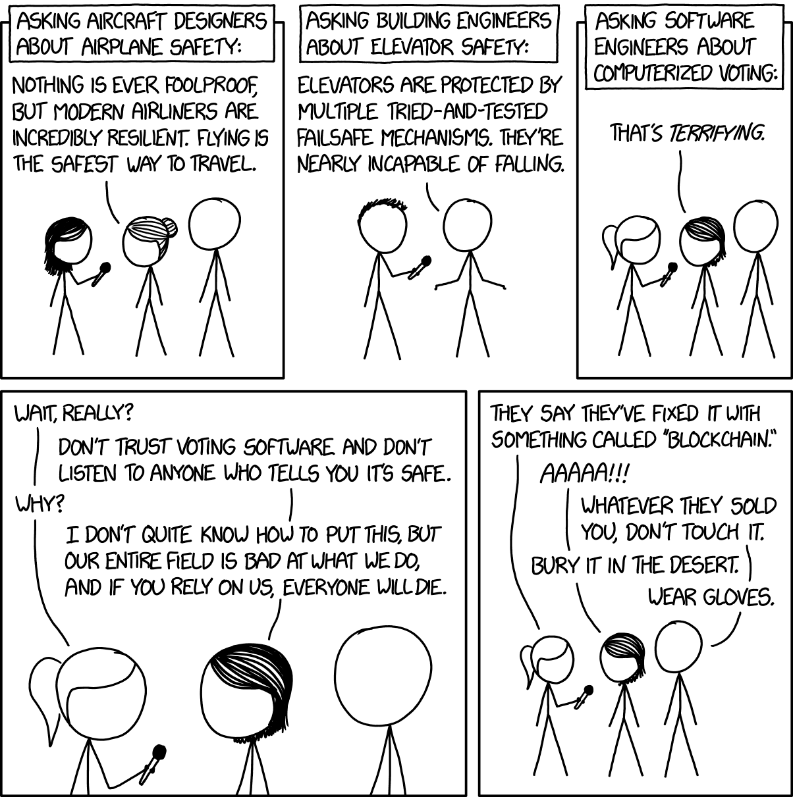

<TLDR title='Організовуйте код навколо читання і запису в пам’ять. І розберіться нарешті, що там коїться під капотом у компілятора.' />

Зверніть увагу: редагуючи цю статтю у 2025 році, я досі вважаю все написане актуальним.

## Оптимізація — це не опція, це необхідність

Ми й досі вперлися в стелю можливостей заліза. У багатьох сферах його тупо не вистачає: нейронки, VR, ріал-тайм системи — список можна продовжувати вічно. Є купа девайсів, де кожен міліампер батареї на вагу золота, і ми мусимо рахувати кожен такт процесора. Навіть у хмарах, з їхніми "гумовими" ресурсами, неефективний код спалює цілком реальні кіловати (і долари).

Навіть банальний прогін тестів може тишком-нишком розтягнутися на 5 годин. І це підступно. Продуктивність коду зазвичай нікого не гребе, аж до того моменту, коли все стає *дуже* погано.

Та й нащо взагалі писати на C чи C++, якщо не заради швидкості або контролю над ресурсами?

Сучасний спосіб вичавити продуктивність із кремнію — це робити "залізо" ще складнішим.

## Знайомтесь: Сучасне Залізо

### Процесор (CPU)

- мільярди транзисторів
- намагається передбачити майбутнє
- відстежує залежності даних та інструкцій
- виконує команди паралельно та позачергово (out of order)
- програмований (має власний мікрокод)
- знає про техніки віртуалізації пам'яті та CPU
- має високорівневі інструкції (криптографічні хеш-функції)
- існує щось схоже на нейромережу для покращення передбачення розгалужень (branch prediction)[^1]
- наразі виявлено кілька критичних вразливостей, які можна використати для атак (Spectre, Meltdown).

### DRAM

- мільярди конденсаторів
- мільярди конденсаторів — серйозно!

> DRAM (Dynamic random-access memory) використовує комірки пам'яті, що складаються з одного конденсатора та одного транзистора для зберігання кожного біта. Це найдешевший тип пам'яті з найвищою щільністю, тому він і використовується як основна пам'ять у комп'ютерах[^2].

Завантаження та збереження даних у пам'яті зазвичай є вузьким місцем.

Одне звернення до пам'яті коштує близько 100 наносекунд[^3]. Це означає, що CPU з частотою 1 ГГц може витратити 100 або більше тактів, чекаючи на значення з пам'яті.
Тож кешування значень у пам'яті замість перерахунку може бути буквально в 100 разів повільнішим. Що-що?!

Хоча CPU достатньо розумний, щоб підвантажувати дані наперед, у багатьох випадках саме програмісти відповідають за розміщення в пам'яті та патерни доступу.

Отже, маємо мільярди рядків коду з одного боку і розмаїття апаратних архітектур з іншого. Багато архітектур пропонують свої специфічні методи для досягнення максимальної продуктивності або мінімального енергоспоживання.
Заповнити цю прогалину — означає делегувати більшу частину роботи оптимізуючому компілятору.

> Сучасні компілятори можуть робити багато модифікацій коду для покращення продуктивності. Програмісту корисно знати, що компілятор може, а чого не може.
>
> ~ Агнер Фог “Оптимізація програмного забезпечення на C++” [^4]

Вихідний код, який ми пишемо, читається машиною та нашими колегами-програмістами.
Давайте зосередимося на читабельності коду, нехай компілятори працюють.

Нажаль, нічого не відбувається автомагічно. Оптимізуючі компілятори C та C++ далекі від ідеалу; життєво важливо розуміти, що у компілятора під капотом.
Зрештою, це інструмент, яким ми користуємося щодня.

Є це чудове відео[^5]: «[Understanding Compiler Optimization — Chandler Carruth — Opening Keynote Meeting C++ 2015](https://youtu.be/FnGCDLhaxKU)» (також є посилання на слайди [^6] в кінці).

Я коротенько перекажу, але дуже раджу подивитися самим.

Я спробував повторити кожен приклад із презентації Чендлера самостійно, використовуючи `clang -emit-llvm`, і більшість прикладів коду тут були отримані безпосередньо з LLVM. Хоча деякі лістинги були безсоромно скопіпащені зі слайдів Чендлера Каррута.

> Розуміння продуктивності означає розуміння оптимізаторів.
>
> ~ Чендлер Каррут “Opening Keynote Meeting C++ 2015”

Незважаючи на специфіку LLVM (clang), ті самі принципи застосовуються до GCC, і певною мірою до кожного сучасного оптимізуючого компілятора.

## Знайомство з LLVM IR

LLVM Intermediate Representation (IR) — це мова асемблера для розробників компіляторів.

Компілятори сильно покладаються на форму статичного єдиного присвоєння (static single assignment — SSA), тобто: вимагається, щоб кожній змінній було *присвоєно значення рівно* ***один раз***, і кожна змінна була *визначена* ***до*** *того, як вона буде використана* [^7].

### Hello World

```llvm
declare i32 @g(i32 %x)

define i32 @f(i32 %a, i32 %b) {
entry:
    %c = add i32 %a, %b
    %d = call i32 @g(i32 %c)
    %e = add i32 %c, %d
    ret i32 %e
}
```

Код вище читається як:

- функції: `@g` та `@f`
- типи: `i32`
- значення (змінні): `%a`, `%b`, …
- інструкції: `add`, `call`, `ret`

### Потік керування (Control Flow)

```llvm
declare i32 @g(i32 %x)

define i32 @f(i32 %a, i32 %b, i1 %flag) {
entry:
  %c = add i32 %a, %b
  br i1 %flag, label %then, label %else

then:
  %d = call i32 @g(i32 %c) ret i32 %d

else:
  ret i32 %c
}
```

Операція `br` — це розгалуження (branch) за прапорцем і перехід до відповідної мітки. Ця операція керує всім *потоком керування* (control flow).

### Потік даних (Data Flow)

Знову ж таки: кожній змінній *присвоюється значення рівно* ***один раз***, і кожна змінна *визначається* ***до*** *того, як вона буде використана*.

Але як отримати значення, яке визначене лише всередині розгалуження, як-от `%d` у прикладі вище?

Відповідь — інструкція `phi`, яка об'єднує значення з різних гілок в одне, залежно від того, ***звідки ми прийшли***.

```llvm
declare i32 @g(i32 %x)

define i32 @f(i32 %a, i32 %b, i1 %flag) {
entry:
  %c = add i32 %a, %b
  br i1 %flag, label %then, label %end

then:
  %d = call i32 @g(i32 %c) br label %end

end:
  %result = phi i32 [ %entry, %c ], [ %then, %d ]
  ret i32 %result
}
```

Якщо ми прийшли з `entry`, то `%result = %c`, якщо з `then` — `%result = %d`.

### Ось і веcь LLVM IR

LLVM IR *настільки* простий. Є багато інших інструкцій, але принцип той самий.

Лише на основі цього представлення вже можна спробувати здогадатися що відбувається за лаштунками.

## Працюють оптимізатори

## Крок 1: Прибирання

Фронтенд компілятора генерує «сирий» IR код, ніби пам'ять необмежена; він дбає лише про створення патернів, «знайомих» оптимізатору.

Ось приклад:

```c
int main(int argc, char * argv[]) {
    if (argc != 2)
        return -1;
    printf("%s", argv[1]);
    return 0;
}
```

Ось що ми отримаємо, запустивши `clang -cc1 -emit-llvm -O0 example.c -o example.ll` (без оптимізації).
Фронтенд LLVM розміщує все в пам'яті, тому бачимо ланцюжки `alloca`, `store` та `load`:

```llvm
define i32 @main(i32 %argc, i8** %argv) #0 {
  %1 = alloca i32, align 4
  %2 = alloca i32, align 4
  %3 = alloca i8**, align 8
  store i32 0, i32* %1, align 4
  store i32 %argc, i32* %2, align 4
  store i8** %argv, i8*** %3, align 8
  %4 = load i32, i32* %2, align 4
  %5 = icmp ne i32 %4, 2
  br i1 %5, label %6, label %7

; <label>:6                                       ; preds = %0
  store i32 -1, i32* %1, align 4
  br label %12

; <label>:7                                       ; preds = %0
  %8 = load i8**, i8*** %3, align 8
  %9 = getelementptr inbounds i8*, i8** %8, i64 1
  %10 = load i8*, i8** %9, align 8
  %11 = call i32 (i8*, ...) @printf(i8* getelementptr inbounds ([3 x i8], [3 x i8]* @.str, i32 0, i32 0), i8* %10)
  store i32 0, i32* %1, align 4
  br label %12

; <label>:12                                      ; preds = %7, %6
  %13 = load i32, i32* %1, align 4
  ret i32 %13
}
```

На етапі прибирання (cleanup) компілятор намагається замінити інструкції роботи з пам'яттю на значення у формі SSA.
Пізніше буде вирішено, чи виділяти пам'ять, чи використовувати регістри. Більшість змінних взагалі зникне.

Ось що відбувається, коли ми вмикаємо оптимізацію (`-O1`):

```llvm
define i32 @main(i32 %argc, i8** nocapture readonly %argv) #0 {
  %1 = icmp eq i32 %argc, 2
  br i1 %1, label %2, label %6

; <label>:2                                       ; preds = %0
  %3 = getelementptr inbounds i8*, i8** %argv, i64 1
  %4 = load i8*, i8** %3, align 8, !tbaa !1
  %5 = tail call i32 (i8*, ...) @printf(i8* nonnull getelementptr inbounds ([3 x i8], [3 x i8]* @.str, i64 0, i64 0), i8* %4) #1
  br label %6

; <label>:6                                       ; preds = %0, %2
  %.0 = phi i32 [ 0, %2 ], [ -1, %0 ]
  ret i32 %.0
}
```

Звісно, цей код не просто очищений, а й оптимізований. Тепер видно, як LLVM IR відтворює логіку C-коду, з якого його було згенеровано.

Інструкція `icmp` порівнює цілі числа, вказівники або вектори і повертає булеве значення. Перший аргумент вказує на тип порівняння.
Тут `icmp eq` означає перевірку на рівність. Інші приклади: `ult` — беззнакове «менше ніж» (unsigned less than), `sge` — знакове «більше або дорівнює» (signed greater or equal) тощо.

`getelementptr` — це інструкція, що відповідає за всю арифметику вказівників у LLVM.
Однаково адресується і елемент масиву, і поле структури чи класа. Останній аргумент `getelementptr` — це індекс елемента.

`<result> = getelementptr inbounds <ty>, <ty>* <ptrval>{, [inrange] <ty> <idx>}*` [^17]

## Крок 2: Канонізація

Один і той самий код можна написати багатьма способами:

```c
/*..1..............*/
int x;
if (flag)
    x = y;
else
    x = z;

/*..2..............*/
int x = flag ? y : z;

/*..3..............*/
int x = y;
if (!flag)
    x = z;

/*..4..............*/
if (flag)
    z = y;
int x = z;
```

Оптимізатор переписує потік керування у ***канонічну*** форму, замість того щоб намагатися розпізнати кожен можливий варіант у вихідному коді.

Тож кожен цикл перетворюється на *канонічний цикл*, конструкція if-then — на *канонічний if-then*, і так далі.

Повернімося до першого прикладу:

```c
int main(int argc, char * argv[]) {
    if (argc != 2)
        return -1;
    printf("%s", argv[1]);
    return 0;
}
```

Ось відповідний лістинг LLVM IR, трохи змінений для кращої читабельності.

Без оптимізації:

```llvm
define i32 @main(i32 %argc, i8** %argv) {
entry:
  %ret = alloca i32, align 4
  %argc.ptr = alloca i32, align 4
  %argv.ptr = alloca i8**, align 8
  store i32 0, i32* %ret, align 4
  store i32 %argc, i32* %argc.ptr, align 4
  store i8** %argv, i8*** %argv.ptr, align 8
  %argc_2 = load i32, i32* %argc.ptr, align 4
  %flag = icmp ne i32 %argc_2, 2
  br i1 %flag, label %if.then, label %if.end

if.then:
  store i32 -1, i32* %ret, align 4
  br label %return

if.end:
  %argv_2 = load i8**, i8*** %argv.ptr, align 8
  %array_index = getelementptr inbounds i8*, i8** %argv_2, i64 1
  %array_value = load i8*, i8** %array_index, align 8
  %printf_ret = call i32 (i8*, ...) @printf(i8* getelementptr inbounds ([3 x i8], [3 x i8]* @.str, i32 0, i32 0), i8* %array_value)
  store i32 0, i32* %ret, align 4
  br label %return

return:
  %ret_2 = load i32, i32* %ret, align 4
  ret i32 %ret_2
}
```

Канонічний код if-then:

```llvm
define i32 @main(i32 %argc, i8** nocapture readonly %argv) {
entry:
  %flag = icmp eq i32 %argc, 2
  br i1 %flag, label %if.end, label %return

if.end:
  %array_index = getelementptr inbounds i8*, i8** %argv, i64 1
  %array_value = load i8*, i8** %array_index, align 8, !tbaa !1
  %printf_ret = tail call i32 (i8*, ...) @printf(i8* nonnull getelementptr inbounds ([3 x i8], [3 x i8]* @.str, i64 0, i64 0), i8* %array_value) #1
  br label %return

return:
  %retval.0 = phi i32 [ 0, %if.end ], [ -1, %entry ]
  ret i32 %retval.0
}
```

Спершу йде код, що перевіряє кількість аргументів `if (argc != 2)`.

Раніше було: `icmp ne` — інструкція порівняння на ***нерівність***. Тепер бачимо `icmp eq` — порівняння на *рівність*, щоб оптимізатору не доводилося окремо обробляти ці дві інструкції.

Інша відмінність: мітка `if.then` і відповідна гілка виконання зникли. Тепер мітка `return` обробляє ту саму логіку за допомогою вузла `phi`.

Таким чином, потік керування стає прозорішим для оптимізатора, що дозволяє йому приймати точніші рішення.

## Крок 3: Згортання абстракцій

> Я думаю, що те, що відрізняє C++ від будь-якої іншої мови, з якою я коли-небудь працював, — це здатність створювати абстракції, які зникають.
>
> ~ Чендлер Каррут “Opening Keynote Meeting C++ 2015.”

З погляду оптимізатора, існують три основні абстракції:

1. Функції, виклики та граф викликів
2. Пам'ять, читання та запис
3. Цикли

## Функції, виклики та граф викликів

Функція — це фундаментальна абстракція для людини, але процесору вона непотрібна.
Оптимізатор перегруповує інструкції у зручніший для процесора спосіб і позбувається багатьох функцій.

LLVM намагається розбити граф викликів на кластери функцій, щоб працювати в ширшому контексті.
«Листя» цього графа — природні кандидати на пряме вбудовування (inline), оскільки вони не викликають інших функцій.
Інлайнінг (видалення листя) створює нове листя, яке теж можна видалити, і так по колу. Це рішення не обов'язково категоричне — можливий і частковий інлайнінг, і купа інших хитрих перестановок.

Інлайнити чи ні — це *найкритичніше* рішення для генерації оптимізованого коду. Від цього залежить буквально все: кешування, розпаралелювання, використання регістрів, доступ до пам'яті, і так далі.

На щастя, багато функцій створені просто як обгортки над іншими. Їх легко позбутися.

```c
int g(double x, double y, double z);

int f(struct S* s, double y, double x) {
    return g(x, y, s->z);
}
```

Але бувають складні випадки, коли рішення про інлайнінг залежить від значення аргументу або умови розгалуження.
Такі випадки відкладаються, доки LLVM не отримає більше інформації. Наприклад, ви обираєте алгоритм сортування залежно від розміру вектора.
Оптимізатор підніметься по дереву SSA, намагаючись з'ясувати фактичний розмір, щоб прийняти рішення.
На жаль, міжпроцедурні оптимізації можуть вимагати величезних ресурсів, а варіантів вибору може бути безліч.
Досі трапляються випадки, які на перший погляд здаються тривіальними, але де оптимізатори генерують далеко не ідеальний код.

[**HHVM**](https://en.wikipedia.org/wiki/HipHop_Virtual_Machine) (HipHop Virtual Machine) — це віртуальна машина PHP з JIT-компіляцією. Її створили у Facebook для заміни HipHop (транспілятора PHP у C++).

Коли після 12 місяців розробки весь код Facebook запустили на HHVM, він працював у 7 разів повільніше [^8].

Раджу переглянути слайди презентації, але одну річ хочу виділити окремо:

> Коли зміни в одному місці коду прискорюють або сповільнюють зовсім непов'язаний код — підозрюйте кешування.
>
> ~ Кіт Адамс “PHP on the Metal” слайди

(Мається на увазі кеш процесора.)

Команда HHVM провела ґрунтовне розслідування і знайшла винуватця: агресивний інлайнінг `memcpy`.
Розмір коду функції `memcpy` на їхній платформі сягав 11 КБ, що спричиняло «пробуксовку» кешу (cache thrashing). Цей код витісняв корисні дані з кешу процесора по всій програмі.

Рішенням стала реалізація простішої версії `memcpy`, без розгалужень залежно від розміру даних, моделі CPU тощо. Код цієї спрощеної функції помістився всього у дві кеш-лінії.

*Новий `memcpy` показував значно* ***гірші*** *результати в ізольованих мікро-бенчмарках, але суттєво покращив* ***загальну*** *продуктивність програми.*

До речі, ключове слово `inline` майже не має відношення до фактичного процесу інлайнінгу.

*Виправлення від u/quicknir на Reddit:*

> ключове слово `inline` насправді використовується як підказка (hint) в GCC та, ймовірно, в інших компіляторах.
На рівні оптимізації `-O1` для інлайнінгу розглядаються *лише* функції, позначені як `inline`.

## Пам'ять, завантаження та збереження

Як вже згадувалося, фронтенд компілятора генерує код так, ніби пам'ять нескінченна.

Для наступної функції:

```c
int plus(int a, int b) {
    int c = a + b;
    return c;
}
```

LLVM генерує такий неоптимізований код:

```llvm
define i32 @plus(i32, i32) #0 {
  %a.ptr = alloca i32, align 4
  %b.ptr = alloca i32, align 4
  %c.ptr = alloca i32, align 4
  store i32 %a, i32* %a.ptr, align 4
  store i32 %b, i32* %b.ptr, align 4
  %a2 = load i32, i32* %a.ptr, align 4
  %b2 = load i32, i32* %b.ptr, align 4
  %c = add nsw i32 %a2, %b2
  store i32 %c, i32* %c.ptr, align 4
  %c2 = load i32, i32* %c.ptr, align 4
  ret i32 %c2
}
```

Для кожної змінної виділяється пам'ять, куди вона записується і звідки одразу ж зчитується.

Тоді як оптимізований код виглядає значно розумніше:

```llvm
define i32 @plus(i32, i32) local_unnamed_addr #0 {
  %c = add nsw i32 %b, %a
  ret i32 %c
}
```

Тут форма SSA розкривається у всій красі. Оптимізатор аналізує операції читання та запису в пам'ять і намагається визначити фактичні значення. У прикладі вище він робить це без проблем.

Тепер розглянемо трохи складніший приклад:

```c++
struct Point {
    long long x, y;
    Point plus(Point arg) const;
};


Point Point::plus(Point arg) const {
    Point r;
    r.x = x + arg.x;
    r.y = y + arg.y;
    return r;
}
```

Неоптимізований IR:

```llvm
%struct.Point = type { i64, i64 }

; Function Attrs: noinline nounwind optnone ssp uwtable
define { i64, i64 } @Point.plus(%struct.Point*, i64, i64) #0 align 2 {
  %r.ptr = alloca %struct.Point, align 8
  %arg.ptr = alloca %struct.Point, align 8
  %this.ptr = alloca %struct.Point*, align 8
  %arg.rawptr = bitcast %struct.Point* %arg.ptr to { i64, i64 }*
  %arg.x.ptr = getelementptr inbounds { i64, i64 }, { i64, i64 }* %arg.rawptr, i32 0, i32 0
  store i64 %arg.x, i64* %arg.x.ptr, align 8
  %arg.y.ptr = getelementptr inbounds { i64, i64 }, { i64, i64 }* %arg.rawptr, i32 0, i32 1
  store i64 %arg.y, i64* %arg.y.ptr, align 8
  store %struct.Point* %this, %struct.Point** %this.ptr, align 8
  %this.ptr_2 = load %struct.Point*, %struct.Point** %this.ptr, align 8
  %this.x.ptr = getelementptr inbounds %struct.Point, %struct.Point* %this.ptr_2, i32 0, i32 0
  %this.x = load i64, i64* %this.x.ptr, align 8
  %arg.x.ptr = getelementptr inbounds %struct.Point, %struct.Point* %arg.ptr, i32 0, i32 0
  %arg.x = load i64, i64* %arg.x.ptr, align 8
  %r.x = add nsw i64 %this.x, %arg.x
  %r.x.ptr = getelementptr inbounds %struct.Point, %struct.Point* %r.ptr, i32 0, i32 0
  store i64 %r.x, i64* %r.x.ptr, align 8
  %this.y.ptr = getelementptr inbounds %struct.Point, %struct.Point* %this.ptr_2, i32 0, i32 1
  %this.y = load i64, i64* %this.y.ptr, align 8
  %arg.y.ptr = getelementptr inbounds %struct.Point, %struct.Point* %arg.ptr, i32 0, i32 1
  %arg.y = load i64, i64* %arg.y.ptr, align 8
  %r.y = add nsw i64 %this.y, %arg.y
  %r.y.ptr = getelementptr inbounds %struct.Point, %struct.Point* %r.ptr, i32 0, i32 1
  store i64 %r.y, i64* %r.y.ptr, align 8
  %r.rawptr = bitcast %struct.Point* %r.ptr to { i64, i64 }*
  %r.rawptr_2 = load { i64, i64 }, { i64, i64 }* %r.rawptr, align 8
  ret { i64, i64 } %r.rawptr_2
}
```

Зверніть увагу: сигнатура функції змінилася. Нова сигнатура дозволяє компілятору передавати аргументи через регістри.

До: `(Point * this, Point arg)`

Після: `(Point * this, i64 arg.x, i64 arg.y)`

Потік даних у цьому прикладі ускладнюється. Ми звертаємося до кількох ділянок пам'яті, зберігаємо проміжні результати в стеку і працюємо з неявним вказівником `this`.
LLVM намагається розібратися в ситуації шляхом розділення пам'яті (memory partitioning). Він пробує реконструювати окремі сусідні операції читання та запису назад у структури та масиви.

Погляньмо, як із цим впорається оптимізатор.

LLVM IR з `-O1`:

```llvm
define { i64, i64 } @Point.plus(%struct.Point* nocapture readonly, i64, i64) local_unnamed_addr #0 align 2 {
  %this.x.ptr = getelementptr inbounds %struct.Point, %struct.Point* %this, i64 0, i32 0
  %this.x = load i64, i64* %this.x.ptr, align 8, !tbaa !3
  %r.x = add nsw i64 %this.x, %1
  %this.y.ptr = getelementptr inbounds %struct.Point, %struct.Point* %this, i64 0, i32 1
  %this.y = load i64, i64* %this.y.ptr, align 8, !tbaa !8
  %r.y = add nsw i64 %this.y, %2
  %r_1 = insertvalue { i64, i64 } undef, i64 %r.x, 0
  %r_2 = insertvalue { i64, i64 } %r_1, i64 %r.y, 1
  ret { i64, i64 } %r_2
}
```

Інструкція `insertvalue` вставляє значення у поле структури або елемент масиву. Вона працює за індексом елемента, подібно до `getelementptr`.

`<result> = insertvalue <aggregate type> <val>, <ty> <elt>, <idx>{, <idx>}* ; yields <aggregate type>`

Спершу беремо невизначене (undef) складене значення `{i64, i64}` і вставляємо `%r.x` за індексом 0:

`%r_1 = insertvalue { i64, i64 } undef, i64 %r.x, 0`

Потім створюємо `%r_2` на основі `%r_1`.

`%r_2 = insertvalue { i64, i64 } %r_1, i64 %r.y, 1`

Чудово. Тепер ми не бачимо `alloca` — проміжна структура зникла, а значення можуть зберігатися в регістрах процесора.

Інакше доступ до RAM був би буквально в 100 разів повільнішим.

> Найшвидший код — це той, який не виконується.

## Цикли

Цикл — це місце, де програма проводить більшу частину часу, тому цикли є пріоритетними цілями для оптимізатора.
Саме в цьому напрямку ведеться багато досліджень у світі компіляторів.

Погляньмо на наступний цикл:

```c++
int sum(const std::vector<int> & array) {
    int result = 0;
    for (auto i: array) {
        result += i;
    }
    return result;
}
```

Загалом маємо близько 160 рядків неоптимізованого коду LLVM IR (не забувайте про купу виділень пам'яті, жменю викликів функцій STL та код C++ runtime).
Тож у цьому маленькому циклі відбувається чимало всього.

Ось невеликий фрагмент неоптимізованого IR:

```llvm
;   ...
  %36 = load %vector*, %vector** %27, align 8
  %37 = bitcast %vector* %36 to %"class.std::__1::__vector_base"*
  %38 = getelementptr inbounds %"class.std::__1::__vector_base", %"class.std::__1::__vector_base"* %37, i32 0, i32 0
  %39 = load i32*, i32** %38, align 8
  store %vector* %36, %vector** %24, align 8
  store i32* %39, i32** %25, align 8
  %40 = load %vector*, %vector** %24, align 8
  %41 = load i32*, i32** %25, align 8
  store %"class.std::__1::__wrap_iter"* %23, %"class.std::__1::__wrap_iter"** %21, align 8
  store i32* %41, i32** %22, align 8
  %42 = load %"class.std::__1::__wrap_iter"*, %"class.std::__1::__wrap_iter"** %21, align 8
  %43 = load i32*, i32** %22, align 8
  store %"class.std::__1::__wrap_iter"* %42, %"class.std::__1::__wrap_iter"** %19, align 8
  store i32* %43, i32** %20, align 8
  %44 = load %"class.std::__1::__wrap_iter"*, %"class.std::__1::__wrap_iter"** %19, align 8
  %45 = getelementptr inbounds %"class.std::__1::__wrap_iter", %"class.std::__1::__wrap_iter"* %44, i32 0, i32 0
  %46 = load i32*, i32** %20, align 8
  store i32* %46, i32** %45, align 8
  %47 = getelementptr inbounds %"class.std::__1::__wrap_iter", %"class.std::__1::__wrap_iter"* %23, i32 0, i32
;   ...
```

LLVM перетворює ці 160 рядків на майже 170 рядків зовсім іншого IR коду. Розберемо це крок за кроком.

Припустімо, що всі згадані вище техніки оптимізації спрацювали, згорнувши абстракції пам'яті та функцій. На цьому етапі IR код функції `sum` може виглядати так:

```llvm
define i32 @sum(%vector* nocapture readonly dereferenceable(24)) #0 {
entry:
  %begin_ptr = getelementptr inbounds %vector, %vector* %0, i64 0, i32 0, i32 0
  %begin = load i32*, i32** %begin_ptr, align 8, !tbaa !2
  %end_ptr = getelementptr inbounds %vector, %vector* %0, i64 0, i32 0, i32 1
  %end = load i32*, i32** %end_ptr, align 8, !tbaa !8
  br label %loop.head

loop.head:
  %ptr = phi i32* [ %begin, %entry ], [ %ptr.next, %loop.latch ]
  %x = phi i32 [ 0, entry], [ %x.next, %loop.latch ]
  %cond = icmp eq i32* %ptr, %end
  br i1 %cond, label %exit, label %loop.latch

loop.latch:
  %i = load i32, i32* %ptr, align 4
  %x.next = add nsw i32 %x, %i
  %ptr.next = add nsw i32 %x, %i
  br label %loop.head

exit:
  ret i32 %x
}
```

Знову ж таки, маємо канонічну форму. Для оптимізатора критично важливо відрізнити цикл від будь-якої іншої конструкції керування потоком виконання.

```llvm
define i32 @sum(%vector* nocapture readonly dereferenceable(24)) #0 {
entry:
  %begin_ptr = getelementptr inbounds %vector, %vector* %0, i64 0, i32 0, i32 0
  %begin = load i32*, i32** %begin_ptr, align 8, !tbaa !2
  %end_ptr = getelementptr inbounds %vector, %vector* %v, i64 , i32 0, i32 1
  %end = load i32*, i32** %end_ptr, align 8
  %empty = icmp eq i32* %begin, %end
  br i1 %empty, label %exit, label %loop.ph

loop.ph:  ; preds = %entry
  br label %loop

loop: ; preds = %loop.ph, %loop
  %x = phi i32 [ 0, %loop.ph ], [ %x.next, %loop ]
  %ptr = phi i32* [ %begin, %loop.ph ], [ %ptr.next, %loop ]
  %i = load i32, i32* %ptr, align 4
  %x.next = add nsw i32 %x, %i
  %ptr.next = getelementptr inbounds i32, i32* %ptr, i64 1
  %cond = icmp eq i32* %ptr.next, %end
  br i1 %cond, label %loop.exit, label %loop

loop.exit:  ; preds = %loop
  %x.lcssa = phi i32 [ %x.next, %loop ]
  br label %exit

exit: ; preds = %loop.exit, %entry
  %x.result = phi i32 [ %x.lcssa, %loop.exit ], [ 0, %entry ]
  ret i32 %x.result
}
```

Кожна мітка канонічного циклу має чітко визначену роль і гарантії.

Тепер у нас є `loop.ph` — так званий передзаголовок циклу (loop pre-header) і вузли `loop.exit`. Їхня мета — бути єдиними точками входу та виходу з циклу.
Мітка `loop` має попередниками `loop.ph` і саму себе, а `loop.exit` має єдиного попередника — `loop`.
Мітка `exit` відрізняється тим, що ми можемо потрапити туди, взагалі оминувши цикл.

`loop.exit` має цей незвичайний вузол `phi` лише з одним аргументом (рядок 23):

`%x.lcssa = phi i32 [ %x.next, %loop ]`

У формі SSA це означає, що `x.next` «живе» поза циклом. Тобто значення зсередини циклу стає доступним назовні.

Розпізнавши канонічну форму циклу, компілятор застосовує кілька технік оптимізації.

Насамперед оптимізатор вирішує, чи **потрібен цикл** взагалі. Наприклад, якщо відомий розмір масиву, відбудеться розгортання циклу (loop unrolling).
Всі компілятори C++ роблять це бездоганно, оскільки форма SSA природно сприяє розповсюдженню константних значень (constant propagation).

Другий клас оптимізацій виносить зайві операції за межі циклу, і знов-таки форма SSA робить це тривіальним.
Є лише одна точка входу `loop.ph` і один вихід `loop.exit`. Оптимізатор відстежує кожен вузол `phi`, тому точно знає, що змінюється всередині циклу, а що — ні.
Програмісту не потрібно кешувати `vector.size()` чи подібні виклики в локальну змінну — це вам не Python. Оптимізатор сам винесе весь зайвий код із тіла циклу.

Ще одна техніка стосується **умов розгалуження** всередині циклу. Загалом, оптимізатор намагається не просто винести умову назовні, а й створити **окремі спеціалізовані цикли** для кожного випадку.

Після застосування цих технік код циклу стає чистішим і компактнішим, і саме тоді він оптимізується для максимального завантаження CPU.

Сучасні процесори мають високоефективні конвеєри SIMD (Single Instruction, Multiple Data). Тому оптимізатор виконує *векторизацію* циклу — окремий випадок використання SIMD.
У нашому прикладі з функцією `sum` це означає просту річ: виконати одну інструкцію `add` одразу для кількох даних за одну ітерацію.

Оптимізований код може виглядати дещо лячно. Перш ніж ви спробуєте в ньому розібратися — ось короткий вступ.

У цьому коді є три різні цикли:

1. `**loop.vec32**` — основний векторизований цикл. Всередині бачимо `add nsw <4 x i32>` — додавання двох векторів по 4 32-бітних цілих числа (результат — теж вектор `<4 x i32>`). До того ж, цей цикл розгорнутий (unrolled), тому він «перемелює» 32 x 32-бітних числа за одну ітерацію. Звісно, масив повинен мати 32 або більше правильно вирівняних елементів.
2. `**loop.vec8**` — менший векторизований цикл, що працює з двома векторами `<4 x i32>` (разом 8 x 32-бітних чисел).
3. `**loop.scalar**` — наш оригінальний цикл. Все, що він робить — додає два 32-бітних числа одне за одним (`add nsw i32`). Це запасний варіант для масивів та їх останніх шматків менших за 8 елементів.

```llvm
define i32 @sum(%"vector"* nocapture readonly dereferenceable(24)) local_unnamed_addr #0 {
  %2 = getelementptr inbounds %"vector", %"vector"* %0, i64 0, i32 0, i32 0
  %start_ptr = load i32*, i32** %2, align 8, !tbaa !3
  %4 = getelementptr inbounds %"vector", %"vector"* %0, i64 0, i32 0, i32 1
  %end_ptr = load i32*, i32** %4, align 8, !tbaa !9
  %is_empty = icmp eq i32* %start_ptr, %end_ptr
  br i1 %is_empty, label %exit, label %choose.array.size

; <label>:choose.array.size:                                      ; preds = %1
  %8 = ptrtoint i32* %start_ptr to i64
  %last_elem_ptr = getelementptr i32, i32* %end_ptr, i64 -1
  %10 = ptrtoint i32* %last_elem_ptr to i64
  %size = sub i64 %10, %8
  %size_log2 = lshr i64 %size, 2
  %size_log2_plus1 = add nuw nsw i64 %size_log2, 1
  %14 = icmp ult i64 %size_log2_plus1, 8
  br i1 %14, label %loop.scalar.ph, label %has.min.vector.iterations

; <label>:loop.scalar.ph:                                     ; preds = %loop.vec8.exit, %choose.array.size
  %16 = phi i32 [ 0, %choose.array.size ], [ %103, %loop.vec8.exit ]
  %17 = phi i32* [ %start_ptr, %choose.array.size ], [ %20, %loop.vec8.exit ]
  br label %loop.scalar

; <label>:has.min.vector.iterations:                                     ; preds = %choose.array.size
  %size_log2_plus1_higher_bits = and i64 %size_log2_plus1, 9223372036854775800
  %20 = getelementptr i32, i32* %start_ptr, i64 %size_log2_plus1_higher_bits
  %21 = add nsw i64 %size_log2_plus1_higher_bits, -8
  %22 = lshr exact i64 %21, 3
  %23 = add nuw nsw i64 %22, 1
  %24 = and i64 %23, 3
  %25 = icmp ult i64 %21, 24
  br i1 %25, label %loop.vec32.exit, label %loop.vec32.ph

; <label>:loop.vec32.ph:                                     ; preds = %has.min.vector.iterations
  %27 = sub nsw i64 %23, %24
  br label %loop.vec32

; <label>:loop.vec32:                                     ; preds = %loop.vec32, %loop.vec32.ph
  %offset0 = phi i64 [ 0, %loop.vec32.ph ], [ %offset.next, %loop.vec32 ]
  %vec.sum1 = phi <4 x i32> [ zeroinitializer, %loop.vec32.ph ], [ %vec.sum8, %loop.vec32 ]
  %vec.sum0 = phi <4 x i32> [ zeroinitializer, %loop.vec32.ph ], [ %vec.sum9, %loop.vec32 ]
  %chunks.left = phi i64 [ %27, %loop.vec32.ph ], [ %chunks.left.next, %loop.vec32 ]

  %chunk1_begin = getelementptr i32, i32* %start_ptr, i64 %offset0
  %34 = bitcast i32* %chunk1_begin to <4 x i32>*
  %chunk1 = load <4 x i32>, <4 x i32>* %34, align 4, !tbaa !10
  %chunk2_begin = getelementptr i32, i32* %chunk1_begin, i64 4
  %37 = bitcast i32* %chunk2_begin to <4 x i32>*
  %chunk2 = load <4 x i32>, <4 x i32>* %37, align 4, !tbaa !10
  %vec.sum2 = add nsw <4 x i32> %chunk1, %vec.sum1
  %vec.sum3 = add nsw <4 x i32> %chunk2, %vec.sum0

  %offset1 = or i64 %offset0, 8
  %chunk3_begin = getelementptr i32, i32* %start_ptr, i64 %offset1
  %43 = bitcast i32* %chunk3_begin to <4 x i32>*
  %chunk3 = load <4 x i32>, <4 x i32>* %43, align 4, !tbaa !10
  %chunk4_begin = getelementptr i32, i32* %chunk3_begin, i64 4
  %46 = bitcast i32* %chunk4_begin to <4 x i32>*
  %chunk4 = load <4 x i32>, <4 x i32>* %46, align 4, !tbaa !10
  %vec.sum4 = add nsw <4 x i32> %chunk3, %vec.sum2
  %vec.sum5 = add nsw <4 x i32> %chunk4, %vec.sum3

  %offset2 = or i64 %offset0, 16
  %chunk4_begin = getelementptr i32, i32* %start_ptr, i64 %offset2
  %52 = bitcast i32* %chunk4_begin to <4 x i32>*
  %chunk4 = load <4 x i32>, <4 x i32>* %52, align 4, !tbaa !10
  %chunk5_begin = getelementptr i32, i32* %chunk4_begin, i64 4
  %55 = bitcast i32* %chunk5_begin to <4 x i32>*
  %chunk5 = load <4 x i32>, <4 x i32>* %55, align 4, !tbaa !10
  %vec.sum6 = add nsw <4 x i32> %chunk4, %vec.sum4
  %vec.sum7 = add nsw <4 x i32> %chunk5, %vec.sum5

  %offset3 = or i64 %offset0, 24
  %chunk6_begin = getelementptr i32, i32* %start_ptr, i64 %offset3
  %61 = bitcast i32* %chunk6_begin to <4 x i32>*
  %chunk6 = load <4 x i32>, <4 x i32>* %61, align 4, !tbaa !10
  %chunk7_begin = getelementptr i32, i32* %chunk6_begin, i64 4
  %64 = bitcast i32* %chunk7_begin to <4 x i32>*
  %chunk7 = load <4 x i32>, <4 x i32>* %64, align 4, !tbaa !10
  %vec.sum8 = add nsw <4 x i32> %chunk6, %vec.sum6
  %vec.sum9 = add nsw <4 x i32> %chunk7, %vec.sum7
  %offset.next = add i64 %offset0, 32
  %chunks.left.next = add i64 %chunks.left, -4
  %70 = icmp eq i64 %chunks.left.next, 0
  br i1 %70, label %loop.vec32.exit, label %loop.vec32, !llvm.loop !12

; <label>:loop.vec32.exit:                                     ; preds = %loop.vec32, %has.min.vector.iterations
  %72 = phi <4 x i32> [ undef, %has.min.vector.iterations ], [ %vec.sum8, %loop.vec32 ]
  %73 = phi <4 x i32> [ undef, %has.min.vector.iterations ], [ %vec.sum9, %loop.vec32 ]
  %74 = phi i64 [ 0, %has.min.vector.iterations ], [ %offset.next, %loop.vec32 ]
  %75 = phi <4 x i32> [ zeroinitializer, %has.min.vector.iterations ], [ %vec.sum8, %loop.vec32 ]
  %76 = phi <4 x i32> [ zeroinitializer, %has.min.vector.iterations ], [ %vec.sum9, %loop.vec32 ]
  %77 = icmp eq i64 %24, 0
  br i1 %77, label %loop.vec8.exit, label %loop.vec8.ph

; <label>:loop.vec8.ph:                                     ; preds = %loop.vec32.exit
  br label %loop.vec8

; <label>:loop.vec8:                                     ; preds = %loop.vec8, %loop.vec8.ph
  %80 = phi i64 [ %74, %loop.vec8.ph ], [ %92, %loop.vec8 ]
  %81 = phi <4 x i32> [ %75, %loop.vec8.ph ], [ %90, %loop.vec8 ]
  %82 = phi <4 x i32> [ %76, %loop.vec8.ph ], [ %91, %loop.vec8 ]
  %83 = phi i64 [ %24, %loop.vec8.ph ], [ %93, %loop.vec8 ]
  %84 = getelementptr i32, i32* %start_ptr, i64 %80
  %85 = bitcast i32* %84 to <4 x i32>*
  %86 = load <4 x i32>, <4 x i32>* %85, align 4, !tbaa !10
  %87 = getelementptr i32, i32* %84, i64 4
  %88 = bitcast i32* %87 to <4 x i32>*
  %89 = load <4 x i32>, <4 x i32>* %88, align 4, !tbaa !10
  %90 = add nsw <4 x i32> %86, %81
  %91 = add nsw <4 x i32> %89, %82
  %92 = add i64 %80, 8
  %93 = add i64 %83, -1
  %94 = icmp eq i64 %93, 0
  br i1 %94, label %loop.vec8.exit, label %loop.vec8, !llvm.loop !15

; <label>:loop.vec8.exit:                                     ; preds = %loop.vec8, %loop.vec32.exit
  %96 = phi <4 x i32> [ %72, %loop.vec32.exit ], [ %90, %loop.vec8 ]
  %97 = phi <4 x i32> [ %73, %loop.vec32.exit ], [ %91, %loop.vec8 ]
  %98 = add <4 x i32> %97, %96
  %99 = shufflevector <4 x i32> %98, <4 x i32> undef, <4 x i32> <i32 2, i32 3, i32 undef, i32 undef>
  %100 = add <4 x i32> %98, %99
  %101 = shufflevector <4 x i32> %100, <4 x i32> undef, <4 x i32> <i32 1, i32 undef, i32 undef, i32 undef>
  %102 = add <4 x i32> %100, %101
  %103 = extractelement <4 x i32> %102, i32 0
  %104 = icmp eq i64 %size_log2_plus1, %size_log2_plus1_higher_bits
  br i1 %104, label %exit, label %loop.scalar.ph

; <label>:exit:                                    ; preds = %loop.scalar, %loop.vec8.exit, %1
  %106 = phi i32 [ 0, %1 ], [ %103, %loop.vec8.exit ], [ %111, %loop.scalar ]
  ret i32 %106

; <label>:loop.scalar:                                    ; preds = %loop.scalar.ph, %loop.scalar
  %108 = phi i32 [ %111, %loop.scalar ], [ %16, %loop.scalar.ph ]
  %109 = phi i32* [ %112, %loop.scalar ], [ %17, %loop.scalar.ph ]
  %110 = load i32, i32* %109, align 4, !tbaa !10
  %111 = add nsw i32 %110, %108
  %112 = getelementptr inbounds i32, i32* %109, i64 1
  %113 = icmp eq i32* %112, %end_ptr
  br i1 %113, label %exit, label %loop.scalar, !llvm.loop !17
}
```

Важко простежити арифметику розміру масиву: LLVM замінив дорогі інструкції ділення (`div` або `mod`) на `lshr` / `and` / `or`.
Це працює, бо правий операнд є степенем двійки. Якщо не зважати на ці трюки з розміром, код має бути досить зрозумілим.

Масив довжиною 129 елементів потрапить у `loop.vec32`, потім у `loop.scalar`, оминувши `loop.vec8`.
А от масив зі 130 елементів пройде через усі гілки. Малий масив (7 або менше елементів) оброблятиметься лише в `loop.scalar`.

## Працює програміст

Компілятор оптимізує лише для середнього випадку, керуючись принципом «не нашкодь». Ви ж повинні знати конкретні критичні ділянки коду та високорівневий потік даних, які потребують тюнінгу.

### Вимірювання продуктивності — це складно

Часто усунути вузьке місце не так важко, як знайти його причину — це справжній виклик. Інструментуючі (non-sampling) та вбудовані профайлери можуть втручатися в роботу коду і маскувати проблеми з продуктивністю.
Семплюючі профайлери (sampling profilers) втрачають частину інформації та можуть викривляти результати через похибку вимірювань.

Чим більше ви знаєте, тим краще. Розуміння інструментів та середовища — критичне. Як працює профайлер? Які прапорці компілятора вплинуть на розслідування? Що саме вони роблять? Як зменшити шум від заліза та ОС?
Що відбувається всередині того довгого системного виклику? Чи ефективні ці інструкції на цій моделі CPU? Чи не вимірюю я часом продуктивність порожнього циклу?
У Чендлера Каррута є ще одна чудова доповідь про бенчмаркінг та використання профайлерів[^9] (не можу не рекомендувати цього хлопця — робити наш C/C++ код швидшим — це його хліб).

Розуміння асемблеру не причиняє болю. Та гаразд-гаразд, з часом болітиме менше.
Сайт Агнера Фога [^10] — чудова відправна точка для вивчення «заліза» та низькорівневих технік оптимізації.

Медіани, середні значення та 95-ті перцентилі часто не означають майже нічого; навпаки — вони можуть втопити всі корисні сигнали в шумі. [^11]
Інтерпретація результатів бенчмаркінгу буває підступною. Вивчіть трохи статистики та теорію експерименту (як рахувати похибку).

### Контроль доступу до RAM

Якщо не йдеться про дуже інтенсивні обчислення на CPU, доступ до пам'яті стає вузьким місцем.

Проблема комплексна, і тут є багато нюансів.

Сучасні процесори намагаються приховати від нас той факт, що ***пам'ять — повільна***. Розуміння роботи «заліза» критично важливе, щоб витиснути з нього максимум.

«**What every programmer should know about memory**» Ульріха Дреппера[^12] — обов'язкове чтиво, якщо ви дбаєте про продуктивність.
Заодно нарешті дізнаєтесь що таке CAS і RAS які ви стільки років бачили в BIOS.

### Послідовний доступ до RAM набагато кращий за випадковий

Послідовний доступ настільки важливий, що іноді наївні алгоритми сортування можуть стабільно перевершувати найбільш хитромудрі оптимізації на певних наборах даних.
Множення матриць може працювати в рази швидше залежно від порядку доступу до рядків/стовпців.

Алгоритм криптовалюти CryptoNote намагається захиститися від апаратних майнерів (ASIC), використовуючи великий обсяг пам'яті з випадковим доступом.
Випадковий доступ до пам'яті шкодить паралельному виконанню багатьма способами.

### Вирівнювання даних

Деякі процесори привчили нас вірити, що невирівняний доступ (unaligned access) — це нормально. Іноді нам навіть щастить уникнути падіння продуктивності (якщо ми не перетинаємо межі кеш-лінії процесора).
Хоча прості операції читання та запису можуть проходити гладко на x86-процесорах, атомарні операції та інструкції SIMD вимагають суворого вирівнювання даних.
На більшості процесорів ARM невирівняний доступ до пам'яті викличе апаратний збій (hardware panic).

Код серіалізації/десеріалізації часто є джерелом невирівняних даних.

### Кеш процесора (CPU Caches)

Знову ж таки, є багато аспектів, на які варто звернути увагу для отримання оптимальної розкладки пам'яті.

Просте емпіричне правило (з точки зору продуктивності): те, що часто використовується разом, має зберігатися разом.

Розглянемо наступний приклад.
Уявіть, що ми хочемо знайти деякі елементи на основі їхньої бітової маски. Щось на зразок цього:

```c++
struct Foo {
    int mask;
    double value1;
    double value2;
    double value3;
    // ...
};

void search(int needle, const std::vector<Foo>& haystack, std::ostream& out) {
    for (auto f : haystack) {
        if (f.mask & needle) {
            out << f;
        }
    }
}
```

Тут ми проганяємо кожен елемент (32+ байт) через кеш процесора лише для того, щоб стерти дані з кешу і викинути їх на наступній ітерації. Але ми можемо використовувати кеш набагато краще, перетасувавши області пам'яті.

Давайте винесемо `int mask` зі структури `Foo` в окремий масив:

```c++
struct Foo {
    double value1;
    double value2;
    double value3;
    // ...
};

void search(int needle, const std::vector<int>& foomasks, const std::vector<foo>& foodata, std::ostream& out) {
    for (int i = 0; i < foomasks.size(); ++i) {
        if (foomasks[i] & needle) {
            out << foodata[i];
        }
    }
}
```

Таким чином, кеш процесора не витрачається на непотрібні (в нашому випадку) `value1, value2, …`, а компілятор перетворить тіло циклу: `foomasks[i] & needle` на векторизований код, який обробляє кілька масок одночасно.
Така оптимізація може дати суттєве покращення. (За умови, що кількість елементів велика, а селективність маски низька).

Але тепер нам доводиться няньчитися з двома масивами. Читабельність коду безумовно постраждала, і з'явилася можливість для купки неприємних багів.

### Запис у пам'ять в обхід кешу CPU

Якщо ви збираєтеся записати великий обсяг пам'яті для подальшого використання, можливо, ви захочете записати його в обхід кешу процесора.
У цьому випадку процесор видає лише інструкції запису без попереднього читання пам'яті, і що важливіше, кеш не буде забруднений даними, які вам зараз не потрібні.

Сімейство інтринсиків `_mm_stream_siXXX` виконує завантаження, використовуючи підказку про нетемпоральну пам'ять (non-temporal memory hint).

### Попереднє завантаження даних з пам'яті (Prefetch)

Процесори роблять це самі більшу частину часу, але ми маємо перевагу, знаючи наші конкретні дані.
Просто пам'ятайте, що отримання даних займає час, тому немає сенсу попередньо завантажувати дані безпосередньо перед тим, як вони вам знадобляться.
Ми повинні робити prefetch, поки ще є робота, яку треба завершити.

Один із способів попереднього завантаження даних — видати вбудовану інструкцію компілятора, наприклад `__builtin_prefetch` у GCC або `_mm_prefetch` із заголовка `xmmintrin.h`.

Інший спосіб — почати читати потрібні дані з іншого потоку.

Звісно, це все легше сказати, ніж зробити. Попереднє завантаження даних може спричинити "cache thrashing" (постійне витіснення даних з кешу) і призвести до результатів, протилежних очікуваним.

### Передбачення переходів (Branch prediction)

Теми доступу до пам'яті та передбачення переходів тісно пов'язані. Одна річ, яка може стати в нагоді — це підказати компілятору ймовірність конкретної гілки. Це можна зробити або за допомогою відомих макросів `likely/unlikely` (`__builtin_expect` у GCC), або, що краще, за допомогою оптимізації на основі профілю (PGO — profile-guided optimization).

Ви можете запустити програму під типовим навантаженням і створити профіль цього виконання. Цей профіль (файл) використовується як додатковий параметр для оптимізатора. Дані можуть включати кількість переходів, частоту викликів функцій та іншу інформацію, що дозволяє компілятору приймати більш точні рішення залежно від наданого навантаження.

З мого досвіду, однак, це не дає величезного приросту продуктивності. Такі оптимізації слід розглядати як останній засіб для отримання невеликого загального прискорення.

### Лічильники продуктивності CPU

Часто немає єдиного вузького місця, тому незрозуміло, з чого взагалі почати.
У таких випадках апаратні лічильники продуктивності CPU надають безцінну інформацію: кількість неправильно передбачених переходів, кількість промахів кешу для коду та даних, записи в пам'ять тощо.
Тож замість того, щоб оптимізувати якісь функції всліпу, ви можете зосередитися на покращенні цих показників.

Інструмент [perf](https://perf.wiki.kernel.org/index.php/Main_Page) та [OProfile](http://oprofile.sourceforge.net/about/) на Linux дозволяють отримати доступ до апаратних лічильників продуктивності, Xcode може робити це на Mac, і існує безліч інструментів від виробників CPU, наприклад [Intel® Performance Counter Monitor](https://software.intel.com/en-us/articles/intel-performance-counter-monitor).

### Зробіть свої наміри зрозумілими для компілятора

Іноді ручні оптимізації, такі як розгортання циклів або заміна розгалужень арифметикою вказівників, дають значне локальне покращення, але можуть несподівано вдарити по загальній продуктивності.

Завжди існує компроміс між читабельністю коду та продуктивністю. Дбайте про те, щоб ваш код був зрозумілим для людей. Не намагайтеся вразити компілятор і своїх колег «топ-100 дивовижними бітовими хаками».
Всі витончені трюки, які ви знаєте, колись застаріють. Поведінка заліза зміниться. Кодова база житиме своїм життям.

Візьмемо нашу функцію `sum` із прикладу з циклами і викличемо її з константним значенням:

```c++
int sum(const std::vector<int> & array) {
    int result = 0;
    for (auto i: array) {
        result += i;
    }
    return result;

int main() {
    const std::vector<int> elems{1,2,3,4};
    return sum(elems);
}
```

LLVM IR (-O2):

```llvm
define i32 @main() #1 personality i8* bitcast ...
  ret i32 10
}
```

Вся програма була виконана під час компіляції. Все це `std::__XZZF_you_re_sick_of_this_cr*p_::__iterator__Stable_v1_XYZ_operator` зникло.
Виділення пам'яті в купі для вектора через виклики `std::allocator` зникли — залишилося лише `return 10`.

Я не вважаю цей приклад *чесним* — як я вже писав, форма SSA робить розповсюдження константних значень (constant propagation) елементарним, але я вважаю це дуже *вражаючим*.

### Передача аргументів за вказівником (посиланням) має приховану ціну

Код нижче може завдати клопоту оптимізатору.

```c++
int foo(int a, int b) {
    int c;
    bar(a, b, c);
    return a + b + c;
}

void bar(int a, int b, int& c) {
    c = a * b;
}
```

Тепер рішення: «чи інлайнити `foo`» залежить від доступу до пам'яті (залежність від даних) і від функції `bar` (залежність від коду).

### Але ж const …

На жаль, для оптимізатора не існує такого поняття, як const-вказівник.

Уявіть такі ситуації:

```c++
template <typename To, typename From>
inline To union_cast(From x) {
    union {
        From from;
        To to;
    } converter;
    converter.from = x;
    return converter.to;
}
```

…або приведення вказівника до вказівника, або трюки з масивами, або переповнення цілих чисел, або переповнення буфера.
Це ми ще навіть не згадали звичайнісінький `const_cast`, існує безліч можливостей посилатися на ту саму область пам'яті в C і C++ (aliasing), навмисно чи випадково.

Наступна думка — *паралелізм*. Якщо немає спільних даних, немає чого блокувати.
Сучасні багатоядерні процесори здатні до високопаралельного виконання, і немає потреби витрачати дорогоцінні цикли на блокування (ми ж можемо замість цього майнити криптовалюти, бггг).

У багатьох випадках повернення аргументів замість передачі їх за посиланням дозволяє компілятору бачити потік даних і створювати більш ефективний код.

Варто згадати філософію мови Go

> Don't communicate by sharing memory; share memory by communicating.

(я не можу перекласти це належним чином)

### Не використовуйте члени структури для зберігання проміжних результатів

Це ще один спосіб ускладнити життя оптимізатору:

```c++
struct Foo {
    double a;
    double b;
    double c;
    double compute();
};

double Foo::compute() {
  a = heavy_calc_a();
  b = heavy_calc_b();
  c = heavy_calc_c();
  return a+b+c;
}
```

Тепер оптимізатору доводиться думати про вказівник `this` і розмірковувати, чи є побічні ефекти. Людям також було б важко читати такий код.

Чисті, тобто без побічних ефектів, функції набагато легше читати і людям, і компіляторам.

### Використовуйте сучасний стандарт C/C++

C++11 і новіші стандарти забезпечують семантику переміщення (move semantics), а оптимізація повертаємого значення (RVO) гарантована.

І C, і C++ мають занадто багато випадків, коли поведінка наших програм залежить від внутрішньої реалізації компілятора.
Сучасні стандарти намагаються усунути ці темні кутки і мінімізувати можливу шкоду від невизначеної поведінки (UB).

Крім того, новіші компілятори надають допоміжні інструменти, такі як: лінтери, чекери, форматери тощо.

### Не працюйте компілятором

Спробуйте знайти помилку в цьому циклі, розгорнутому вручну:

```c++
static int rr_cmp(uchar *a, uchar *b)
{
  if (a[0] != b[0])
    return (int) a[0] - (int) b[0];
  if (a[1] != b[1])
    return (int) a[1] - (int) b[1];
  if (a[2] != b[2])
    return (int) a[2] - (int) b[2];
  if (a[3] != b[3])
    return (int) a[3] - (int) b[3];
  if (a[4] != b[4])
    return (int) a[4] - (int) b[4];
  if (a[5] != b[5])
    return (int) a[1] - (int) b[5];
  if (a[6] != b[6])
    return (int) a[6] - (int) b[6];
  return (int) a[7] - (int) b[7];
}
```

*Наведений вище приклад взято з чудової статті команди статичного аналізатора PVS-Studio.[^13]*

Рядок 14: там залишилося `a[1]` від копіпасту, де мало бути `a[5]`.

Знову ж таки, розгортання циклів — це те, що компілятори C і C++ вміють робити добре без будь-якої допомоги програміста.

### Exceptions на сучасних процесорах мають близький до нуля оверхед

> Важливо, що «нульовий *оверхед*» не означає нульову *вартість* — звісно, використання чогось завжди тягне за собою певні витрати.
> Скоріше, принцип нульового оверхеду в C++ завжди означав, що (а) «ви не платите за те, що не використовуєте» і (б) «коли ви це використовуєте, ви не можете [розумно] написати це ефективніше вручну».
>
> ~ Герб Саттер “Zero-overhead deterministic exceptions: Throwing values” [^15]

Звісно, [близький до] нульового оверхед буває лише для штатного сценарію (happy path).
Процесор виконає фіналізатори фреймів і буде стрибати по стеку, спричиняючи купу промахів кешу, перетасовку TLB тощо, коли виняток таки викидається.

Ви ж все одно не стали б симулювати pattern matching за допомогою винятків, правда?

*Поправка від u/matthieum з Reddit*

> З іншого боку, наявність винятків може заважати роботі оптимізатора.

*Олександр Крижановський у Facebook надав посилання[^16] на статтю “* C++ exception handling internals *” — детальне пояснення того, як винятки обробляються бібліотекою часу виконання C++.*

### Використовуйте стільки санітайзерів та статичних аналізаторів, до скількох можете дотягнутися

Це не порада щодо продуктивності, але раз ви вже тут:

> Найважливіша річ, яку я зробив як програміст за останні роки — це агресивне використання статичного аналізу коду.
>
> ~ Джон Кармак з “In-Depth: Static Code Analysis” на Gamasutra [^14]

Сучасні інструменти неймовірно корисні.
З мого досвіду, навіть хибно-позитивне спрацьовування часто вказує на невиправдано складний код.
Сьогодні компілятор сам по собі є чудовим аналізатором. Все, що вам потрібно — це увімкнути `-Wall` ціною того, що код стане трохи чистішим — це перемога.

## Компілятор — це просто ще одна програма

> Оптимізуючі компілятори настільки важко зробити правильними, що ми наважимося сказати, що жоден оптимізуючий компілятор не є повністю безпомилковим!
>
> ~ Ахо, Лам, Сеті, Ульман у "Compilers: Principles, Techniques, & Tools 2nd Edition"

Вся наша індустрія неідеальна. Та, дідько — ми всі жахливі.

Обов'язкове посилання на xkcd:


Оптимізуючий компілятор, безумовно, може мати помилки; він може, наприклад, викинути код, пов'язаний з безпекою, тому що для нього немає явного використання;
Компілятор навіть може сам внести нову вразливість.

Колись прийде потужний ШІ щоб відмолити наші баги, а доти хтось має робити код швидким.

## Підсумок

- Складність програмних систем зростає
- Апаратне забезпечення стає складнішим і різноманітнішим
- CPU швидкий і складний; DRAM повільна і дешева
- Ми повинні делегувати більшість низькорівневих оптимізацій CPU компілятору і зосередитися на потоці даних та створенні читабельного коду
- Розуміння продуктивності також означає розуміння оптимізуючого компілятора, заліза та системи в цілому
- Вимірювання продуктивності — це складно
- Локальні оптимізації іноді можуть показувати дивовижні результати на мікро-бенчмарках, водночас калічачи загальну продуктивність програми

## Якщо ви хочете погратися з LLVM

На GitHub є трохи [Makefile Voodoo](https://github.com/cachelot/llvm_playground)
Якщо ви коли-небудь хотіли перекласти шматок C/C++ в LLVM IR та асемблерні лістинги — просто покладіть файл ‘.c’ або ‘.cpp’ у цю директорію і запустіть `make`.
Це має створити лістинги ‘.ll’ та ‘.asm’ для кожного рівня оптимізації: -O0..-O3 -Os

На Mac зі встановленими Xcode та command-line tools все запрацює в мить... Напевно.

```shell
git clone https://github.com/cachelot/llvm_playground.git
cd llvm_playground
<your_editor_of_choice> whatever.cpp  # *.c if you'd wanted plain C
make
```

---

## Посилання

[^1]: [Hacker News: Neural network spotted deep inside Samsung’s Galaxy S7 silicon brain](https://news.ycombinator.com/item?id=12340348)
[^2]: [“Semiconductor memory” on Wikipedia](https://en.wikipedia.org/wiki/Semiconductor_memory)
[^3]: [Latency Numbers Every Programmer Should Know](http://www.eecs.berkeley.edu/~rcs/research/interactive_latency.html)
[^4]: [Optimizing software in C++: An optimization guide for Windows, Linux and Mac platforms by Agner Fog (pdf)](https://www.agner.org/optimize/optimizing_cpp.pdf)
[^5]: [YouTube: Understanding Compiler Optimization — Chandler Carruth — Opening Keynote Meeting C++ 2015](https://youtu.be/FnGCDLhaxKU)
[^6]: [Understanding Compiler Optimization — Chandler Carruth — Opening Keynote Meeting C++ 2015 slides (pdf)](https://meetingcpp.com/files/mcpp/2015/talks/meetingcxx_2015-understanding_compiler_optimization_themed_copy.pdf)
[^7]: [Wikipedia: SSA — Static Single Assignment form](https://en.wikipedia.org/wiki/Static_single_assignment_form)
[^8]: [PHP on the Metal slides by Keith Adams](https://qconsf.com/sf2012/dl/qcon-sanfran-2012/slides/KeithAdams_PHPOnTheMetalWithHHVMMOVEDTOBALLROOMBC.pdf)
[^9]: [YouTube: CppCon 2015: Chandler Carruth “Tuning C++: Benchmarks, and CPUs, and Compilers! Oh My!”](https://youtu.be/nXaxk27zwlk)
[^10]: [Software optimization resources by Agner Fog](https://www.agner.org/optimize/)
[^11]: [Your Load Generator Is Probably Lying To You — Take The Red Pill And Find Out Why](http://highscalability.com/blog/2015/10/5/your-load-generator-is-probably-lying-to-you-take-the-red-pi.html)
[^12]: [What every programmer should know about memory, Part 1.](http://lwn.net/Articles/250967)
[^13]: [PVS-Studio –– The Ultimate Question of Programming, Refactoring, and Everything](https://www.viva64.com/en/b/0391/#ID0E5CAE)
[^14]: [In-Depth: Static Code Analysis on Gamasutra](http://www.gamasutra.com/view/news/128836/InDepth_Static_Code_Analysis.php)
[^15]: [Zero-overhead deterministic exceptions: Throwing values by Herb Sutter](http://www.open-std.org/jtc1/sc22/wg21/docs/papers/2018/p0709r0.pdf)
[^16]: [C++ exception handling internals by Nicolás Brailovsky](https://monoinfinito.wordpress.com/series/exception-handling-in-c/)
[^17]: [LLVM Language Reference Manual](https://llvm.org/docs/LangRef.html)
